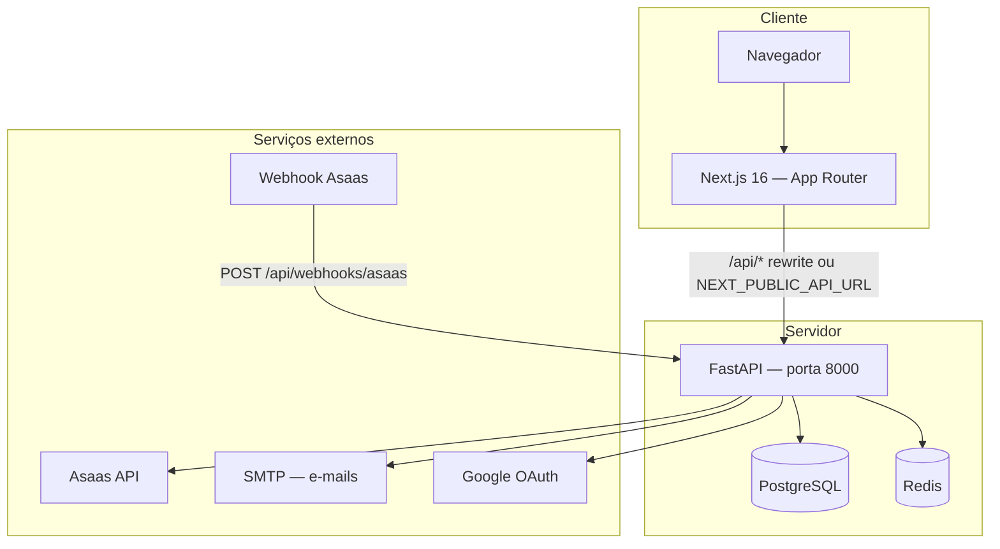
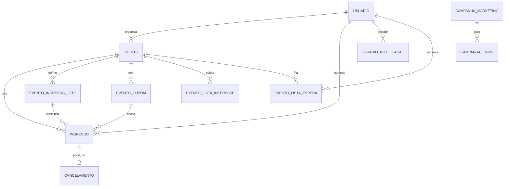

# 00 — Documentação completa do sistema EventosBR

Documento **único e consolidado** do produto, arquitetura, funcionalidades, tecnologias e esquema do banco de dados. Complementa o [índice da pasta `docs/`](./README.md) e a spec de produção em [`specs/eventosbr-producao.md`](../specs/eventosbr-producao.md).

---

## 1. Visão geral do produto

A **EventosBR** é uma plataforma brasileira de venda de ingressos para eventos. Conecta **organizadores** (produtores) e **compradores** (participantes) com:

- Páginas públicas de evento por **slug** (`/eventos/{slug}`)
- **Lotes de ingressos** com preços, capacidade e janelas de venda
- Pagamento online via **Asaas** (PIX, cartão de crédito com parcelamento, boleto/fatura)
- **Split** automático: repasse ao organizador + taxa da plataforma
- **Cancelamento e reembolso** dentro de prazo configurável
- **Check-in** na portaria (app do organizador ou link secreto sem conta)
- **Lista de interesse** (pré-venda) e **lista de espera** (esgotado)
- **Cupons** de desconto, **cortesias**, **repasse** de ingresso entre participantes
- Painel do **organizador** (eventos, relatórios, financeiro Asaas, comunicados)
- Painel **admin** da plataforma (moderação, campanhas de marketing)
- **Perfil público do produtor** (`/produtor/{slug}`)

No site Next.js há também páginas institucionais: `/documentacao`, `/funcionalidades`, `/planos`, `/ajuda/*`, `/blog`, `/termos`, `/privacidade`, `/sobre`.

---

## 2. Arquitetura

### Modos de comunicação front ↔ API

| Modo | Configuração | Comportamento |
|------|--------------|---------------|
| **Same-origin (dev)** | `NEXT_PUBLIC_API_URL` vazio | Browser chama `localhost:3000/api/*`; Next reescreve para o backend |
| **URL absoluta** | `NEXT_PUBLIC_API_URL=http://...` | Browser chama a API diretamente; exige `CORS_ORIGINS` correto |
| **Docker / SSR** | `INTERNAL_API_URL=http://api:8000` | Server Components usam URL interna; browser usa `NEXT_PUBLIC_API_URL` |

### Ciclo de vida da API (`app/main.py`)

- **`lifespan`**: em `development`, `create_tables()`; em produção, migrações via **Alembic**
- Workers em background: e-mail de ingresso, limpeza de reservas, limpeza de lista de espera, lembretes de evento
- Endpoints de saúde: `GET /health` (liveness), `GET /ready` (readiness + BD)

---

## 3. Stack tecnológica

### Backend (API)

| Componente | Tecnologia | Versão / notas |
|------------|------------|----------------|
| Linguagem | Python | 3.11+ |
| Framework HTTP | FastAPI | 0.115.x |
| Servidor ASGI | Uvicorn | 0.34.x |
| ORM | SQLAlchemy | 2.0.x |
| Validação / settings | Pydantic v2, pydantic-settings | |
| Migrações | Alembic | 1.14.x |
| BD produção | PostgreSQL | via `psycopg2-binary` |
| BD dev simples | SQLite | `sqlite:///./eventos.db` |
| Cache / filas | Redis | rate limit, fila de e-mail |
| Auth | JWT (python-jose) + bcrypt | cookie HttpOnly `eventosbr_session` |
| OAuth | Google Sign-In | `google-auth` |
| Pagamentos | Asaas REST API | PIX, cartão, boleto; split |
| QR Code | qrcode + Pillow | ingressos e portaria |
| Exportação | fpdf2, openpyxl | presença PDF/Excel |
| Testes | pytest + httpx TestClient | SQLite em memória |

### Frontend (web)

| Componente | Tecnologia | Versão / notas |
|------------|------------|----------------|
| Framework | Next.js (App Router) | 16.x |
| UI | React | 19.x |
| Linguagem | TypeScript | 5.x |
| Estilos | Tailwind CSS | v4 |
| Fonte | Geist | |
| QR leitura portaria | html5-qrcode | |
| E2E | Playwright | projetos smoke, patamar, compra, asaas |
| Build | `output: "standalone"` | imagem Docker |

### Infraestrutura

| Componente | Tecnologia |
|------------|------------|
| Containers | Docker + Docker Compose |
| Proxy produção | Caddy (ver `docs/08-deploy-hostinger.md`) |
| CI | GitHub Actions (pytest, build Next, E2E) |

---

## 4. Perfis de utilizador e funcionalidades

### 4.1 Comprador / participante (`tipo=cliente`)

| Funcionalidade | Descrição | Rotas / páginas |
|----------------|-----------|-----------------|
| Registo e login | E-mail/senha, compra rápida, Google OAuth | `/auth`, `/api/auth/*` |
| Verificação de e-mail | Token com expiração; reenvio | `/auth/verificar-email` |
| Recuperação de senha | Token 1 h | `/api/auth/solicitar-recuperacao-senha` |
| Vitrine de eventos | Lista pública com filtros (cidade, categoria, texto, intervalo de datas `?de=&ate=`) | `/eventos` |
| Detalhe e compra | Lotes, urgência, cupom, parcelamento, termo de compra | `/eventos/{slug}` |
| Checkout Asaas | PIX (QR + copia-e-cola), cartão transparente, fatura | `CheckoutAsaasPainel` |
| Lista de interesse | Inscrição quando venda ainda não abriu | `POST /api/listas/interesse/{slug}` |
| Lista de espera | Fila quando esgotado; link exclusivo com prazo | `POST /api/listas/espera/{slug}` |
| Meus ingressos | QR, download HTML, reenvio e-mail, repasse, Wallet (em breve) | `/conta/ingressos` |
| Meus pagamentos | Histórico e cancelamento dentro do prazo | `/conta/pagamentos` |
| Perfil | Nome, e-mail, senha, opt-in marketing | `/conta/perfil` |
| Notificações in-app | Centro de notificações | `/conta/notificacoes` |

### 4.2 Organizador / produtor (`tipo=organizador`)

| Funcionalidade | Descrição | Rotas / páginas |
|----------------|-----------|-----------------|
| Criar evento | Slug automático, lotes, imagem, categoria, cidade | `/eventos/novo`, `/organizador/novo` |
| Editar evento | Lotes, cupons, urgência, parcelamento, listas, publicar/pausar | `/eventos/{slug}/editar` |
| Meus eventos | Lista, publicar, duplicar, resumo | `/organizador/eventos` |
| Cupons | Percentual ou valor fixo, limite de usos, validade | `/api/eventos/id/{id}/cupons` |
| Lista de interesse | Export CSV, painel de inscritos | `/api/eventos/id/{id}/lista-interesse` |
| Link portaria | Token secreto + regeneração | `/api/eventos/id/{id}/link-portaria` |
| Check-in | Scanner QR ou busca por nome/CPF | `/organizador/checkin` |
| Relatórios | Receita, conversão, participantes CSV | `/organizador/relatorios` |
| Financeiro Asaas | Wallet, subconta, antecipação cartão | `/organizador/financeiro` |
| Comunicados | E-mail em massa para compradores do evento | `/organizador/comunicados` |
| Perfil público | Slug, bio, foto, redes sociais | `/organizador/perfil`, `/produtor/{slug}` |

### 4.3 Portaria (sem conta)

| Funcionalidade | Descrição |
|----------------|-----------|
| Link secreto | `/portaria/{eventoId}/{token}` — valida `eventos.checkin_token` |
| Check-in QR | `POST /api/portaria/validar` |
| Busca manual | `POST /api/portaria/buscar` por nome/CPF |

### 4.4 Administrador da plataforma

Protegido por `PLATFORM_ADMIN_API_KEY` (header `X-Platform-Admin-Key`) e cookie admin no frontend.

| Funcionalidade | Descrição |
|----------------|-----------|
| Dashboard setup | Checklist de produção |
| Moderação | Publicar/despublicar eventos; ativar/desativar utilizadores |
| Marketing | Campanhas e-mail/WhatsApp para opt-in LGPD |
| Teste SMTP | `POST /api/admin/smtp-test` |

---

## 5. API — routers e prefixos

Montados em `app/main.py`:

| Prefixo | Módulo | Responsabilidade principal |
|---------|--------|---------------------------|
| `/api/auth` | `auth.py` | Registo, login, OAuth, perfil, recuperação senha, verificação e-mail |
| `/api/eventos` | `eventos.py` | CRUD eventos, vitrine, cupons, lista interesse, portaria, duplicar |
| `/api/pagamentos` | `pagamentos.py` | Criar cobrança, Asaas, cupom, cancelar, retomar pagamento |
| `/api/ingressos` | `ingressos.py` | Meus ingressos, QR, download, e-mail, repasse |
| `/api/checkin` | `checkin.py` | Validação QR (organizador autenticado) |
| `/api/portaria` | `portaria.py` | Check-in via token secreto |
| `/api/organizador` | `organizador.py` | Comunicados, config Asaas do organizador |
| `/api/relatorios` | `relatorios.py` | Métricas e exportação participantes |
| `/api/listas` | `listas.py` | Lista interesse e lista espera |
| `/api/notificacoes` | `notificacoes.py` | Notificações in-app do utilizador |
| `/api/produtor` | `produtor.py` | Perfil público do produtor |
| `/api/simuladores` | `simuladores.py` | Simulação de taxas/parcelamento |
| `/api/admin` | `admin.py` | Administração da plataforma |
| `/api/webhooks` | `webhooks.py` | Webhook Asaas; mock-payment (dev) |

Documentação interativa (apenas `ENVIRONMENT=development`): Swagger `/docs`, ReDoc `/redoc`.

---

## 6. Frontend — páginas principais

| Rota | Público | Descrição |
|------|---------|-----------|
| `/` | Sim | Landing |
| `/eventos` | Sim | Vitrine com filtros |
| `/eventos/{slug}` | Sim | Página do evento + compra |
| `/eventos/novo`, `/eventos/{slug}/editar` | Organizador | Criação/edição |
| `/produtor/{slug}` | Sim | Perfil público do organizador |
| `/auth` | Sim | Login/registo |
| `/conta/*` | Autenticado | Perfil, ingressos, pagamentos, notificações |
| `/organizador/*` | Organizador | Painel completo |
| `/portaria/{eventoId}/{token}` | Token | Check-in colaborador |
| `/admin/*` | Admin | Moderação e marketing |
| `/documentacao` | Sim | Resumo técnico no site |
| `/documentacao/api` | Sim | Referência de rotas gerada a partir do `openapi.json` estático (produção não expõe `/docs` do FastAPI) |
| `/funcionalidades`, `/planos`, `/ajuda/*`, `/blog` | Sim | Conteúdo institucional |
| `/termos`, `/privacidade`, `/sobre` | Sim | Legal |

Componentes-chave: `comprar-ingresso.tsx`, `checkout-asaas-painel.tsx`, `evento-lotes-editor.tsx`, `eventos-lista-publica.tsx`, `lista-interesse-form.tsx`, `lista-espera-form.tsx`.

### SEO, acessibilidade e vitrine

- **Metadata**: `lib/site-metadata.ts` centraliza `<title>`/description/Open Graph; `app/sitemap.ts` e `app/robots.ts` geram `sitemap.xml`/`robots.txt`.
- **Filtro de eventos de teste**: `lib/eventos-vitrine.ts` (frontend) e `app/services/evento_vitrine.py` (API) escondem eventos com nomes/locais de teste (`Cortesia Grátis`, `Rua Teste`, `E2E`, `QA`) da vitrine pública — evita que dados de QA apareçam para visitantes.
- **Prova social**: `home-prova-social.tsx` (números reais via `/api/eventos/stats-publicas`), `home-depoimentos.tsx` e `home-selos-confianca.tsx` na home.
- **Acessibilidade**: skip-link (`skip-to-content.tsx`), `focus-visible` global em `globals.css`, `alt` descritivo em imagens de evento e no logo (`eventosbr-logo.tsx`); imagens de marketing em WebP (menor peso, melhora LCP).
- **API documentada**: `scripts/export-openapi.py` gera `frontend/public/openapi.json` a partir do schema real do FastAPI; regenerar sempre que rotas mudarem.
- **Lighthouse (build de produção local, jul/2026)**: `/` — performance 97, acessibilidade 100, boas práticas 96, SEO 100; `/eventos` — performance 96, acessibilidade 100, SEO 100; `/funcionalidades` — performance 92, acessibilidade 96, SEO 100.

---

## 7. Workers e tarefas em background

Iniciados no `lifespan` de `app/main.py`:

| Worker | Módulo | Função |
|--------|--------|--------|
| E-mail de ingresso | `ticket_email.py` | Fila Redis (ou memória): envio SMTP após pagamento |
| Limpeza de reservas | `reserva_cleanup.py` | Cancela ingressos `pendente` com `reservado_ate` expirado |
| Limpeza lista espera | `lista_espera_cleanup.py` | Expira tokens de compra exclusiva da fila |
| Lembrete de evento | `lembrete_evento.py` | E-mail antes do evento (`lembrete_enviado_em`) |

---

## 8. Integrações externas

### Asaas (pagamentos)

- Cobranças: PIX, cartão (com parcelamento configurável por evento), boleto/fatura
- Split: `asaas_wallet_id` do organizador + `ASAAS_PLATFORM_WALLET_ID` da plataforma
- Webhook: `POST /api/webhooks/asaas` com header `asaas-access-token`
- Idempotência: tabela `webhook_events`
- Subconta organizador: chave API cifrada em repouso (`enc:v1:` + Fernet)

### SMTP (e-mails transacionais)

- Ingresso pago, comunicados do organizador, recuperação de senha, verificação de e-mail, lembretes
- Variáveis: `EMAIL_SERVER`, `EMAIL_PORT`, `EMAIL_USER`, `EMAIL_PASSWORD`, `FRONTEND_PUBLIC_URL`

### Google OAuth

- Login e registo via ID token; vinculação a conta existente com senha
- `GOOGLE_OAUTH_CLIENT_ID` no backend; frontend lê `/api/auth/oauth-config`

### Redis

- Rate limit distribuído (check-in, portaria)
- Fila de e-mail de ingresso (`TICKET_EMAIL_USE_REDIS`)

---

## 9. Banco de dados — tabelas e colunas

ORM: **SQLAlchemy** sobre `config.database.Base`. PKs: **UUID em string**. Timestamps: naive UTC.

### Diagrama ER (completo)

---

### `usuarios`

Utilizadores da plataforma (compradores e organizadores).

| Coluna | Tipo | Nullable | Descrição |
|--------|------|----------|-----------|
| `id` | String (UUID) | PK | Identificador único |
| `email` | String | UK, index | E-mail de login |
| `nome` | String | | Nome completo |
| `senha_hash` | String | Sim | Hash bcrypt; `NULL` para OAuth |
| `auth_provider` | String(20) | | `email`, `google` ou `apple` |
| `auth_provider_id` | String(255) | Sim, index | ID no provedor OAuth |
| `tipo` | String | | `cliente` ou `organizador` |
| `asaas_customer_id` | String | Sim | Customer Asaas |
| `asaas_wallet_id` | String | Sim | Wallet para split de pagamentos |
| `asaas_account_id` | String | Sim | Conta Asaas |
| `asaas_subaccount_api_key` | String | Sim | Chave subconta (cifrada em repouso) |
| `asaas_anticipacao_cartao` | Boolean | Sim | Opt-in antecipação automática |
| `ativo` | Boolean | | Conta ativa (default `true`) |
| `token_version` | Integer | | Invalida JWTs ao alterar senha/desativar |
| `aceita_comunicacao_email` | Boolean | | Opt-in marketing e-mail (LGPD) |
| `aceita_comunicacao_whatsapp` | Boolean | | Opt-in marketing WhatsApp |
| `telefone` | String(20) | Sim | Telefone BR |
| `comunicacao_consentimento_em` | DateTime | Sim | Data do consentimento marketing |
| `senha_reset_token` | String(64) | Sim, index | Token recuperação de senha |
| `senha_reset_expires` | DateTime | Sim | Expiração do token (1 h) |
| `slug_publico` | String | Sim, UK, index | Slug do perfil `/produtor/{slug}` |
| `bio` | Text | Sim | Biografia pública |
| `foto_url` | Text | Sim | URL da foto de perfil |
| `social_instagram` | String | Sim | @ Instagram |
| `social_whatsapp` | String | Sim | WhatsApp público |
| `social_site` | String | Sim | Site pessoal |
| `email_verificado` | Boolean | | E-mail confirmado |
| `email_verificacao_token` | String(64) | Sim, index | Token verificação e-mail |
| `email_verificacao_expires` | DateTime | Sim | Expiração verificação |
| `data_criacao` | DateTime | | |
| `data_atualizacao` | DateTime | | |

---

### `eventos`

Eventos criados por organizadores.

| Coluna | Tipo | Nullable | Descrição |
|--------|------|----------|-----------|
| `id` | String (UUID) | PK | |
| `slug` | String | UK, index | URL pública (`/eventos/{slug}`) |
| `organizador_id` | String | FK → `usuarios.id` | Dono do evento |
| `nome` | String | index | Título |
| `descricao` | Text | | Descrição longa |
| `data_inicio` | DateTime | | Início do evento |
| `data_fim` | DateTime | | Fim (obrigatório na BD) |
| `local` | String | | Endereço / local |
| `cidade` | String(120) | Sim, index | Cidade (filtro vitrine) |
| `imagem_url` | Text | Sim | Banner (URL ou base64) |
| `categoria` | String(80) | | Ex.: Música, Teatro, Outros |
| `mensagem_confirmacao` | Text | Sim | Texto pós-compra |
| `preco_ingresso` | Float | | Menor preço entre lotes ativos (vitrine) |
| `limite_ingressos_por_cpf` | Integer | Sim | Máx. ingressos ativos por CPF; `NULL` = sem limite |
| `asaas_wallet_id` | String | Sim | Wallet do organizador no momento da criação |
| `urgencia_modo` | String(20) | | `desligado`, `exato` ou `faixa` (escassez na UI) |
| `parcelamento_habilitado` | Boolean | | Cartão parcelado via Asaas |
| `parcelamento_max` | Integer | | Máximo de parcelas (default 2) |
| `aceita_interesse` | Boolean | | Lista de interesse na pré-venda |
| `lista_espera_habilitada` | Boolean | | Fila quando esgotado |
| `lista_espera_prazo_horas` | Integer | | Prazo do link exclusivo (default 24 h) |
| `publicado` | Boolean | | `false` = pausado (oculto na vitrine) |
| `checkin_token` | String(64) | Sim, UK, index | Token link portaria |
| `checkin_token_em` | DateTime | Sim | Data geração/rotação do token |
| `data_criacao` | DateTime | | |
| `data_atualizacao` | DateTime | | |

---

### `evento_ingresso_lotes`

Lotes de ingressos por evento.

| Coluna | Tipo | Nullable | Descrição |
|--------|------|----------|-----------|
| `id` | String (UUID) | PK | |
| `evento_id` | String | FK → `eventos.id` CASCADE, index | |
| `nome` | String(120) | | Ex.: 1º Lote, Meia-entrada |
| `tipo` | String(20) | | `inteira`, `meia`, `vip`, `cortesia` |
| `preco` | Float | | Preço em reais |
| `ordem` | Integer | | Prioridade de venda (menor primeiro) |
| `quantidade_maxima` | Integer | Sim | Capacidade; `NULL` = ilimitado |
| `ativo` | Boolean | | Lote disponível para venda |
| `vendas_inicio` | DateTime | Sim | Início da janela de venda |
| `vendas_fim` | DateTime | Sim | Fim da janela de venda |

Ocupação = ingressos com `lote_id` e `status` em (`pendente`, `pago`).

---

### `evento_cupons`

Cupons de desconto por evento.

| Coluna | Tipo | Nullable | Descrição |
|--------|------|----------|-----------|
| `id` | String (UUID) | PK | |
| `evento_id` | String | FK → `eventos.id` CASCADE, index | |
| `codigo` | String(40) | | Código (único por evento) |
| `tipo` | String(12) | | `percentual` ou `fixo` |
| `valor` | Float | | Percentual (0–100) ou valor em reais |
| `max_usos` | Integer | Sim | Limite de usos; `NULL` = ilimitado |
| `usos` | Integer | | Contador de usos |
| `ativo` | Boolean | | |
| `valido_ate` | DateTime | Sim | Expiração opcional |

Constraint: `UNIQUE(evento_id, codigo)`.

---

### `ingressos`

Ingressos vendidos ou reservados.

| Coluna | Tipo | Nullable | Descrição |
|--------|------|----------|-----------|
| `id` | String (UUID) | PK | |
| `evento_id` | String | FK → `eventos.id` | |
| `usuario_id` | String | FK → `usuarios.id` | Responsável financeiro (não muda no repasse) |
| `participante_nome` | String(200) | Sim | Quem vai ao evento |
| `participante_email` | String(255) | Sim | |
| `participante_cpf` | String(14) | Sim | |
| `participante_telefone` | String(20) | Sim | |
| `asaas_payment_id` | String | index | ID cobrança Asaas |
| `valor` | Float | | Valor pago (reais) |
| `status` | String | | `pendente`, `pago`, `cancelado`, `usado` |
| `lote_id` | String | Sim, FK → `evento_ingresso_lotes.id`, index | |
| `cupom_id` | String | Sim, FK → `evento_cupons.id` SET NULL | |
| `cortesia_responsavel` | String(200) | Sim | Emissor da cortesia |
| `reservado_ate` | DateTime | Sim | Expiração da reserva pendente (~35 min) |
| `lembrete_enviado_em` | DateTime | Sim | Controle do e-mail de lembrete |
| `repassado_para_nome` | String(200) | Sim | Novo participante (repasse) |
| `repassado_para_cpf` | String(14) | Sim | |
| `repassado_para_email` | String(255) | Sim | |
| `repassado_para_telefone` | String(20) | Sim | |
| `repassado_para_data_nascimento` | String(10) | Sim | `YYYY-MM-DD` |
| `repassado_em` | DateTime | Sim | Data do repasse |
| `checkin_em` | DateTime | Sim | Data/hora do check-in |
| `checkin_por_id` | String | Sim, FK → `usuarios.id` | Operador do check-in |
| `termo_compra_aceito_em` | DateTime | Sim | Auditoria aceite termo |
| `termo_compra_versao` | String(32) | Sim | Versão do termo aceito |
| `data_compra` | DateTime | | |
| `data_limite_cancelamento` | DateTime | | Prazo para reembolso (default +10 dias) |

QR Code: payload assinado `EBR1:{uuid}:{hmac}`.

---

### `cancelamentos`

Reembolsos solicitados (relação 1:1 com ingresso).

| Coluna | Tipo | Nullable | Descrição |
|--------|------|----------|-----------|
| `id` | String (UUID) | PK | |
| `ingresso_id` | String | FK → `ingressos.id`, UK | |
| `valor_reembolso` | Float | | Valor devolvido |
| `status` | String | | `pendente`, `processado`, `falhou` |
| `asaas_refund_id` | String | Sim | ID reembolso Asaas |
| `data_solicitacao` | DateTime | | |
| `data_processamento` | DateTime | Sim | |

---

### `webhook_events`

Idempotência de webhooks Asaas.

| Coluna | Tipo | Nullable | Descrição |
|--------|------|----------|-----------|
| `id` | String | PK | ID do evento Asaas |
| `tipo` | String | | Tipo do evento (`PAYMENT_CONFIRMED`, etc.) |
| `data_recebimento` | DateTime | | |

---

### `evento_lista_interesse`

Inscrições de interesse (pré-venda, antes da abertura de vendas).

| Coluna | Tipo | Nullable | Descrição |
|--------|------|----------|-----------|
| `id` | String (UUID) | PK | |
| `evento_id` | String | FK → `eventos.id` CASCADE, index | |
| `email` | String | | E-mail do interessado |
| `nome` | String | Sim | |
| `data_criacao` | DateTime | | |

Constraint: `UNIQUE(evento_id, email)`.

---

### `evento_lista_espera`

Fila de espera quando ingressos esgotados.

| Coluna | Tipo | Nullable | Descrição |
|--------|------|----------|-----------|
| `id` | String (UUID) | PK | |
| `evento_id` | String | FK → `eventos.id` CASCADE, index | |
| `usuario_id` | String | Sim, FK → `usuarios.id` SET NULL | Utilizador logado (opcional) |
| `email` | String | | |
| `nome` | String | Sim | |
| `posicao` | Integer | | Posição na fila |
| `status` | String(20) | | `aguardando`, `notificado`, `comprou`, `expirado`, etc. |
| `token_compra` | String(64) | Sim, UK, index | Link exclusivo de compra |
| `token_expira_em` | DateTime | Sim | Expiração da janela exclusiva |
| `notificado_em` | DateTime | Sim | Quando foi avisado da vaga |
| `data_criacao` | DateTime | | |

Constraint: `UNIQUE(evento_id, email)`.

---

### `usuario_notificacoes`

Notificações in-app por utilizador.

| Coluna | Tipo | Nullable | Descrição |
|--------|------|----------|-----------|
| `id` | String (UUID) | PK | |
| `usuario_id` | String | FK → `usuarios.id` CASCADE, index | |
| `tipo` | String(40) | | Ex.: `lista_espera`, `evento_aberto` |
| `titulo` | String(200) | | |
| `mensagem` | Text | | |
| `link` | String | Sim | URL de ação |
| `lida` | Boolean | | |
| `data_criacao` | DateTime | | |

---

### `campanhas_marketing`

Campanhas criadas pelo admin da plataforma.

| Coluna | Tipo | Nullable | Descrição |
|--------|------|----------|-----------|
| `id` | String (UUID) | PK | |
| `nome` | String(200) | | Nome interno |
| `assunto` | String(200) | | Assunto do e-mail |
| `mensagem` | Text | | Corpo HTML/texto |
| `canal` | String(12) | | `email`, `whatsapp` ou `ambos` |
| `status` | String(20) | | `rascunho`, `disparada`, `concluida` |
| `total_destinatarios` | Integer | | |
| `enviados_ok` | Integer | | |
| `enviados_erro` | Integer | | |
| `criado_em` | DateTime | | |
| `disparado_em` | DateTime | Sim | |

---

### `campanha_envios`

Envio individual por destinatário de campanha.

| Coluna | Tipo | Nullable | Descrição |
|--------|------|----------|-----------|
| `id` | String (UUID) | PK | |
| `campanha_id` | String | FK → `campanhas_marketing.id` CASCADE | |
| `usuario_id` | String | Sim | |
| `nome` | String(200) | | |
| `email` | String(255) | Sim | |
| `telefone` | String(20) | Sim | |
| `canal_envio` | String(12) | | |
| `status` | String(20) | | `pendente`, `enviado`, `erro` |
| `erro_msg` | String(500) | Sim | |
| `enviado_em` | DateTime | Sim | |

---

## 10. Migrações Alembic

Ficheiros em `alembic/versions/`. Produção: `alembic upgrade head`.

| Revisão | Descrição |
|---------|-----------|
| `20260511_000001` | Init — tabelas base |
| `20260511_000002` | `eventos.preco_ingresso` |
| `20260512_000003` | `ingressos.participante_nome/email` |
| `20260512_000004` | `eventos.imagem_url` Text |
| `20260513_000005` | `ingressos.participante_cpf/telefone` |
| `20260514_000006` | Tabela `evento_ingresso_lotes`; `ingressos.lote_id` |
| `20260516_000007` | `limite_ingressos_por_cpf`; `lotes.tipo`; check-in |
| `20260517_000008` | Cupons e cortesia |
| `20260518_000009` | Opt-in comunicação marketing |
| `20260519_000010` | Campanhas marketing |
| `20260520_000011` | OAuth (`auth_provider`, `token_version`) |
| `20260522_000012` | `eventos.checkin_token` |
| `20260522_000013` | Repasse de ingresso |
| `20260523_000014` | `token_version` |
| `20260523_000015` | `ingressos.reservado_ate` |
| `20260523_000016` | Termo de compra |
| `20260523_000017` | Recuperação de senha |
| `20260524_000018` | `eventos.cidade`; multi-ingresso |
| `20260616_000019` | `email_verificado`; `checkin_token_em` |
| `20260617_000020` | Integração Asaas pagamentos |
| `20260617_000021` | Asaas organizador (wallet, subconta) |
| `20260617_000022` | Patamar UX: parcelamento, listas, urgência, perfil público, notificações |
| `20260618_000022` | Renomeia `stripe_events` → `webhook_events` |
| `20260618_000023` | Remove colunas Stripe legadas |
| `20260618_000024` | Cifra `asaas_subaccount_api_key` |
| `20260619_000025` | `plano_tarifa` do organizador + solicitações de saque |
| `20260620_000026` | `repasse_parcelamento` no evento |
| `20260621_000027` | Valor líquido repassado por ingresso (ledger financeiro) |
| `20260622_000028` | Validade da assinatura mensal do organizador |
| `20260622_000029` | Idempotência do pagamento da assinatura |
| `20260623_000030` | Ciclo de renovação e aviso de assinatura |
| `20260624_000031` | Status de aprovação da conta de repasse Asaas |
| `20260625_000032` | `ingressos.pago_em` + campos de saque Asaas (white-label) |
| `20260626_000033` | Lançamento: CPF de repasse, estorno em ingresso |

---

## 11. Variáveis de ambiente principais

| Variável | Descrição |
|----------|-----------|
| `DATABASE_URL` | PostgreSQL ou SQLite |
| `SECRET_KEY` | Chave JWT (obrigatória fora de development) |
| `ASAAS_API_KEY` | Chave API Asaas |
| `ASAAS_WEBHOOK_TOKEN` | Token do webhook |
| `ASAAS_PLATFORM_WALLET_ID` | Wallet da plataforma (split) |
| `ASAAS_ENVIRONMENT` | `production` (homologação só em desenvolvimento local) |
| `ASAAS_DISABLED` | Desliga pagamentos reais |
| `CORS_ORIGINS` | Origens permitidas (lista separada por vírgula) |
| `REDIS_URL` | Redis para filas e rate limit |
| `EMAIL_*` | SMTP transacional |
| `FRONTEND_PUBLIC_URL` | Base dos links em e-mails |
| `GOOGLE_OAUTH_CLIENT_ID` | Login Google |
| `PLATFORM_ADMIN_API_KEY` | Admin da plataforma |
| `ENVIRONMENT` | `development`, `test`, `production` |

Lista completa: `config/settings.py` e [06-configuracao-operacao.md](./06-configuracao-operacao.md).

---

## 12. Testes e qualidade

| Tipo | Local | Comando |
|------|-------|---------|
| API (unit/integration) | `tests/` | `pytest` |
| Build frontend | `frontend/` | `npm run build` |
| E2E Playwright | `frontend/e2e/` | `npm run test:e2e` (build + servidor de produção local) |
| E2E compra / Asaas | CI | projetos `compra`, `asaas` |

Testes usam SQLite em memória e `ASAAS_DISABLED=true` por padrão (`conftest.py`).

---

## 13. Deploy e go-live

| Documento | Conteúdo |
|-----------|----------|
| [08-deploy-hostinger.md](./08-deploy-hostinger.md) | Docker, Caddy, DNS, VPS |
| [11-go-live-asaas.md](./11-go-live-asaas.md) | Webhook, chaves, checklist de pagamentos, testes mock no VPS |
| [09-auditoria-seguranca-ux.md](./09-auditoria-seguranca-ux.md) | Segurança e UX |
| [10-checklist-proximo-patamar.md](./10-checklist-proximo-patamar.md) | Roadmap produto |

---

## 14. Documentação complementar

| Documento | Foco |
|-----------|------|
| [01-visao-geral-arquitetura.md](./01-visao-geral-arquitetura.md) | Diagramas e fluxos |
| [02-backend-modulos-rotas.md](./02-backend-modulos-rotas.md) | Detalhe de cada rota e serviço |
| [03-modelos-de-dados.md](./03-modelos-de-dados.md) | Notas de negócio por entidade |
| [04-frontend-nextjs.md](./04-frontend-nextjs.md) | App Router e componentes |
| [05-pagamentos-lotes-webhooks-asaas.md](./05-pagamentos-lotes-webhooks-asaas.md) | Fluxo de pagamento |
| [06-configuracao-operacao.md](./06-configuracao-operacao.md) | Env, Docker, Alembic |
| [wallet-passes.md](./wallet-passes.md) | Apple/Google Wallet (futuro) |

---

*Última atualização: julho de 2026 — alinhado aos modelos SQLAlchemy e migração `20260626_000033`.*
