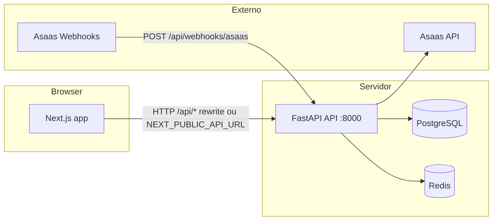
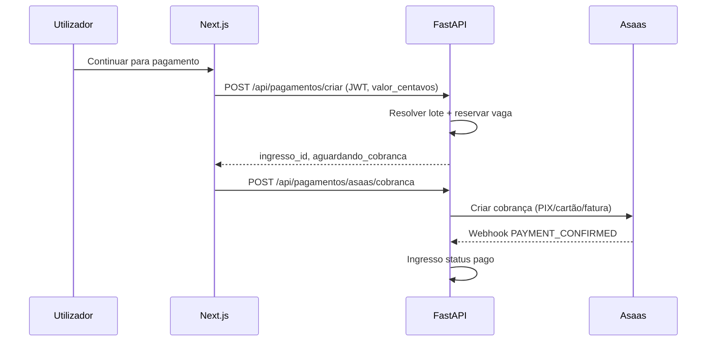

# 01 — Visão geral e arquitetura

## Propósito do produto

A **EventosBR** é uma plataforma para **organizadores** publicarem eventos (página pública por slug), definirem **preços** e **lotes de ingressos**, e para **participantes** comprarem ingresso com **pagamento online** (Asaas — PIX, cartão, fatura). Há fluxo de **cancelamento/reembolso** e **relatórios** para o organizador.

## Stack tecnológica

| Camada | Tecnologia |
|--------|------------|
| API | Python 3.11+, **FastAPI**, **Pydantic v2**, **SQLAlchemy** |
| Base de dados | **PostgreSQL** (produção/Docker) ou **SQLite** (dev simples) |
| Migrações | **Alembic** (`alembic/versions/`) |
| Cache / fila | **Redis** (rate limit, fila de e-mail de ingresso) |
| Pagamentos | **Asaas** (cobranças, split organizador + plataforma, webhooks) |
| Autenticação API | **JWT** (Bearer), senhas com hash (bcrypt via serviço de auth) |
| Frontend | **Next.js** (App Router), **React**, **TypeScript**, **Tailwind CSS v4** |
| Checkout | `CheckoutAsaasPainel` (PIX, cartão transparente, fatura) |

## Diagrama de componentes (lógico)

## Dois modos de o frontend falar com a API

1. **Mesma origem (recomendado em dev com `npm run dev`)**  
   `NEXT_PUBLIC_API_URL` vazio no browser → `fetch` usa a origem do Next (`localhost:3000`). O **Next reescreve** `/api/*` para o backend (`next.config.ts` → `rewrites` para `API_PROXY_TARGET` / `INTERNAL_API_URL` / `127.0.0.1:8000`).

2. **URL absoluta da API**  
   `NEXT_PUBLIC_API_URL=http://localhost:8000` → o browser chama diretamente a API. Exige **CORS** correto (`CORS_ORIGINS` no backend).

No **Docker**, o container `web` usa `INTERNAL_API_URL=http://api:8000` para **SSR**; o browser usa `NEXT_PUBLIC_API_URL` conforme o ambiente.

## Ciclo de vida da aplicação FastAPI (`app/main.py`)

- **`lifespan`**: em `ENVIRONMENT=development`, chama `create_tables()`; em **produção** usar **Alembic** (`alembic upgrade head`).
- **CORS**: origens vindas de `CORS_ORIGINS`.
- **Routers** montados em `/api/...` (ver documento 02).

## Fluxo resumido: compra de ingresso

## Fluxo resumido: organizador cria evento

1. Registo/login como `tipo=organizador` (customer Asaas opcional; `walletId` em Financeiro).
2. `POST /api/eventos/criar` com dados do evento e opcionalmente `ingresso_lotes`.
3. API persiste `Evento`, lotes, sincroniza `preco_ingresso` e devolve `EventoResponse`.

## Onde aprofundar

- Rotas e ficheiros: [02-backend-modulos-rotas.md](./02-backend-modulos-rotas.md)
- Entidades: [03-modelos-de-dados.md](./03-modelos-de-dados.md)
- Asaas e lotes: [05-pagamentos-lotes-webhooks-asaas.md](./05-pagamentos-lotes-webhooks-asaas.md)
