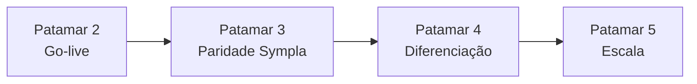

# 10 — Checklist completo: o que temos e o que falta para o próximo patamar

Documento mestre de **produto**, **operação** e **diferenciação** do EventosBR — consolidando fases A–D, auditoria (doc 09), top 10 aprovado e estratégia de migração vs Sympla/Even3.

**Última atualização:** 18/06/2026

---

## Visão do patamar atual

| Nível | Descrição | Situação |
|-------|-----------|----------|
| **Patamar 1 — MVP sólido** | Compra, pagamento, ingresso, check-in, painel organizador | ✅ Concluído |
| **Patamar 2 — Produção confiável** | Deploy real, **Asaas** live, SMTP, webhook, monitoramento | 🟡 Código pronto; falta VPS + credenciais (`eventosbr.app.br` → 502) |
| **Patamar 3 — Paridade Sympla (UX produto)** | Parcelamento, listas, página organizador, simuladores, vitrine | ✅ **Código concluído** (spec `eventosbr-producao.md`) |
| **Patamar 4 — Diferenciação** | Transparência financeira, migração, CRM, selo confiança | 🟡 Parcial (simuladores + taxas públicas OK) |
| **Patamar 5 — Escala** | App equipe offline, API pública, NFSe, assinatura ativa | 🔮 Futuro |

> **Hoje:** Patamar 1 + **Patamar 3 (repo)** concluídos no código. Falta **go-live VPS** (Anexo B) e validação mobile real.

**Provedor de pagamento:** **Asaas** (único no backend). Copy do **comprador** não expõe marca do gateway; organizador configura repasses em Financeiro.

**Extras pós-spec (PR #10+):** máscara BRL em campos de valor (`InputValorBrl`); copy sem marca Asaas no checkout público.

**Documentação consolidada:** [00-sistema-completo.md](./00-sistema-completo.md) · Spec: `specs/eventosbr-producao.md`

---

## Resumo executivo (contagens)

| Área | Temos | Falta (próximo patamar) |
|------|-------|-------------------------|
| Comprador / checkout | 24/24 core patamar | validação mobile |
| Organizador / eventos | 29/29 patamar UX | operadores múltiplos (futuro) |
| Portaria / equipe | 12/12 | — |
| Financeiro / **Asaas** | 14/16 código | 2 críticos (ops VPS) |
| Segurança / UX (auditoria) | 36/36 repo | ops VPS |
| Admin plataforma | 8/8 | — |
| Diferenciação (migração) | 8/15 | migração Sympla, Wallet, selo |
| Qualidade / testes | 11/11 | — (144 pytest + E2E CI) |
| **Total estimado** | **~142 itens OK** | **~8 itens abertos (ops + futuro)** |

---

# ROTEIRO EXECUTIVO — O que falta (~24 itens)

*Versão condensada para execução. Detalhamento nas Partes 2–3 abaixo.*

## Patamar 2 — Go-live (urgente — ops no VPS)

- [ ] `.env` produção: `ASAAS_API_KEY`, `ASAAS_WEBHOOK_TOKEN`, `ASAAS_PLATFORM_WALLET_ID` (doc [11-go-live-asaas](./11-go-live-asaas.md))
- [ ] Webhook Asaas → `https://DOMINIO/api/webhooks/asaas`
- [ ] SMTP + SPF/DKIM no domínio
- [ ] `./scripts/deploy-vps.sh` + `./scripts/verify-production.sh`
- [ ] 1ª venda real (PIX ou cartão) + e-mail de ingresso
- [ ] Organizadores configuram `walletId` em Financeiro antes de vender
- [ ] Monitoramento `/health` e `/ready` (Caddy já expõe)

## Patamar 3 — Top 10 (ordem sugerida)

| # | Item | Status |
|---|------|--------|
| 1 | Temporizador de reserva no checkout | ✅ Feito |
| 2 | Busca manual na portaria | ✅ Feito |
| 3 | Lista de interesse + lista de espera | ✅ Feito |
| 4 | Parcelamento no cartão | ✅ Feito |
| 5 | Múltiplos operadores com permissões | ⏳ Pendente |
| 6 | Página pública do organizador | ✅ Feito (`/produtor/{slug}`) |
| 7 | Formulário customizável na inscrição | ⏳ Pendente |
| 8 | Importação CSV | ⏳ Pendente |
| 9 | Certificados com validação | ⏳ Pendente |
| 10 | PWA modo equipe *(mobile só para equipe)* | ⏳ Pendente |

## Patamar 4 — Diferenciação (migração Sympla)

- [x] Simulador líquido no painel Financeiro (Asaas + taxa plataforma)
- [x] Simulador **dentro do wizard** do evento (criação)
- [ ] Antecipação opt-in em produção (código pronto; testar com subconta real)
- [ ] Selo organizador verificado
- [ ] Assistente de migração Sympla/Even3
- [ ] Webhook por venda + CRM leve
- [ ] Apple/Google Wallet
- [ ] Painel ao vivo na entrada
- [ ] **Garantia EventosBR** (reembolso como marca)

## Roteiro em sprints

| Sprint | Foco | Status |
|--------|------|--------|
| **0** | Go-live (deploy, SMTP, webhook **Asaas**) | 🟡 Código pronto; falta VPS |
| **1** | Quick wins (timer, busca portaria, duplicar UI, simulador) | ✅ 4/4 feitos |
| **2** | Receita (lista espera/interesse, parcelamento, página organizador) | ✅ Concluído no repo |
| **3** | Equipe + migração (operadores, PWA, importação Sympla, selo) | ⏳ |
| **4** | Profundidade (formulário custom, certificados, Wallet, conciliação) | ⏳ |

## Mobile (estratégia aprovada)

| Papel | Canal |
|-------|--------|
| **Cliente** | Web mobile — sem app |
| **Organizador** | Painel web — sem app no início |
| **Equipe** | Link portaria + PWA → app nativo só se precisar |

---

# PARTE 1 — O QUE JÁ TEMOS ✅

## 1. Comprador / participante

### Conta e autenticação
- [x] Cadastro cliente e organizador (`/auth`)
- [x] Login / logout com cookie de sessão
- [x] Recuperação de senha
- [x] Login Google OAuth
- [x] **Compra rápida** (checkout sem senha; definir senha depois)
- [x] Verificação de e-mail (`/auth/verificar-email`)
- [x] Opt-in LGPD (e-mail / WhatsApp no cadastro)
- [x] Perfil do participante (`/conta/perfil`)

### Descoberta e evento público
- [x] Vitrine `/eventos` (busca, categoria, cidade)
- [x] Página do evento por slug (`/eventos/[slug]`)
- [x] Política de reembolso visível na página do evento
- [x] Páginas institucionais (`/sobre`, `/termos`, `/privacidade`, `/planos`, `/funcionalidades`)

### Checkout e pagamento
- [x] Checkout em 3 passos (participante → pagamento → confirmação)
- [x] Múltiplos ingressos na mesma compra (até 10)
- [x] Seleção de lote e quantidade
- [x] Compra para terceiro (nome, e-mail, CPF, telefone)
- [x] Limite de ingressos por CPF no evento
- [x] Cupom de desconto (validação no checkout)
- [x] Lotes cortesia (R$ 0)
- [x] **Asaas — PIX** com QR + copia e cola + polling
- [x] **Asaas — cartão transparente** (dados direto ao Asaas)
- [x] **Asaas — fatura** (redirect cartão/boleto/PIX)
- [x] **Timer visível de reserva** no checkout Asaas
- [x] Split organizador + plataforma (`ASAAS_PLATFORM_WALLET_ID`)
- [x] Aceite de termo de compra
- [x] Reserva de vaga com expiração (backend)
- [x] Retomar pagamento pendente (`/api/pagamentos/retomar`)
- [x] Modo `ASAAS_DISABLED` para testes locais

### Pós-compra
- [x] Lista de pagamentos (`/conta/pagamentos`)
- [x] Cancelamento com reembolso automático (dentro do prazo)
- [x] Lista de ingressos (`/conta/ingressos`)
- [x] Detalhe do ingresso com QR Code
- [x] Ingresso em tela cheia (`/ingresso/qr`)
- [x] Imprimir / HTML do ingresso
- [x] Reenviar e-mail do ingresso
- [x] **Repasse oficial** do ingresso para outra pessoa
- [x] Lembrete por e-mail ~24h antes do evento
- [x] Badge de pagamentos pendentes na navbar

---

## 2. Organizador / produtor

### Painel e onboarding
- [x] Shell do organizador (`/organizador/*`)
- [x] Tour interativo no primeiro acesso
- [x] Wizard em 3 passos para criar evento
- [x] Checklist pré-publicação no passo 3
- [x] Skeletons de carregamento no painel

### Gestão de eventos
- [x] Criar, editar, listar eventos
- [x] Publicar / pausar na vitrine
- [x] Múltiplos lotes (inteira, meia, vip, cortesia)
- [x] Preço, capacidade, janela de venda, ordem dos lotes
- [x] Imagem, categoria, cidade, mensagem de confirmação
- [x] Limite de ingressos por CPF
- [x] Resumo de vendas nos cards (pagos, pendentes, receita)
- [x] Link para página pública do evento
- [x] Breadcrumb ao editar evento
- [x] API duplicar evento (`POST /api/eventos/id/{id}/duplicar`)
- [x] **Botão duplicar evento na UI** (painel do organizador)

### Cupons e preços
- [x] CRUD de cupons na edição do evento
- [x] Simulador de lucro em `/planos` (taxa padrão vs assinatura)

### Comunicação e relatórios
- [x] Comunicados em massa para participantes pagos (`/organizador/comunicados`)
- [x] Relatórios com métricas, série diária, conversão (`/organizador/relatorios`)
- [x] Export CSV, PDF, Excel de participantes
- [x] Financeiro estimado (`/organizador/financeiro`) — taxas da plataforma
- [x] **Painel Asaas** em Financeiro (walletId, subconta, antecipação opt-in, simulador)

### Check-in e portaria
- [x] Scanner QR no painel (`/organizador/checkin`)
- [x] Link secreto de portaria (sem conta da equipe)
- [x] **Busca manual na portaria** (nome, e-mail, CPF) — organizador e link portaria
- [x] Rotação automática do token de portaria
- [x] Regeneração manual do link
- [x] Feedback sonoro + vibração no check-in OK
- [x] Bloqueio de check-in duplicado (`ok: false` + `ja_utilizado`)
- [x] Rate limit na portaria

### Pagamentos / conta
- [x] **Asaas** — customer no cadastro, split, webhook, reembolso
- [x] **Onboarding organizador** — `walletId`, criar subconta, antecipação cartão (opt-in)
- [x] Validação: evento sem wallet **não vende** (proteção split)
- [x] Wallet Asaas do organizador no cadastro/edição de perfil
- [x] Split de pagamento plataforma + organizador via Asaas

---

## 3. Portaria / equipe (web)

- [x] Página `/portaria/[eventoId]/[token]` sem login
- [x] Scanner QR via `html5-qrcode` (sem CDN externo)
- [x] Abas câmera / foto / digitar / **buscar**
- [x] Modo festa (feedback visual ampliado)
- [x] Colar código da área de transferência
- [x] Leitura de URL do QR na câmera

---

## 4. Plataforma / admin

- [x] Painel admin (`/admin/dashboard`)
- [x] Moderação de eventos e usuários
- [x] Campanhas de marketing (opt-in LGPD)
- [x] Checklist de produção no admin (**inclui checks Asaas**)
- [x] Teste SMTP via API admin
- [x] Login admin por cookie + API key

---

## 5. Segurança e UX (auditoria — doc 09)

- [x] Proxy admin sem bypass de env
- [x] Middleware com validação de sessão real
- [x] Bloqueio `/organizador/*` e `/admin/*`
- [x] CSP com nonce em produção
- [x] Verificação de e-mail na compra rápida
- [x] Rotação token portaria
- [x] Mensagens de erro em português
- [x] Migração Alembic `20260616_000019` (e-mail verificado, portaria)
- [x] Migração Alembic `20260617_000020` (campos Asaas pagamentos)
- [x] Migração Alembic `20260617_000021` (subconta + antecipação organizador)
- [x] Cliente SMTP unificado
- [x] Scripts `migrate-db.sh`, `smoke-auditoria.sh`, `verify-production.sh`, `asaas-webhook-setup.sh`, `qa-funcional.py`

---

## 6. Infraestrutura e qualidade

- [x] API FastAPI + PostgreSQL + Alembic
- [x] Frontend Next.js App Router
- [x] Docker Compose dev e prod
- [x] Caddy + guia Hostinger (doc 08) + **`/health` e `/ready` públicos**
- [x] Webhook **Asaas** (`POST /api/webhooks/asaas`)
- [x] Webhook Asaas *(dev + testes)*
- [x] Fila de e-mail (worker)
- [x] Rate limit (portaria, registro, checkout, busca portaria)
- [x] **pytest 115+** (`ASAAS_DISABLED=true` em testes)
- [x] **QA API 24/24** (`scripts/qa-funcional.py`)
- [x] **E2E smoke 4/4** + compra checkout + fluxo org/cliente
- [x] Testes integração Asaas (`test_pagamentos_asaas.py`, `test_organizador_asaas.py`)
- [x] `production_checks` (Asaas + SMTP + CORS)
- [x] `.env.production.example` com Asaas
- [x] Runbook go-live: **doc [11-go-live-asaas](./11-go-live-asaas.md)**

---

## 7. Diferenciais já existentes (subutilizados no marketing)

- [x] Reembolso automático sem chamado ao suporte
- [x] Repasse oficial de ingresso entre participantes
- [x] Compra rápida sem cadastro completo
- [x] Taxas publicadas + simulador em `/planos`
- [x] QR assinado (`EBR1:uuid:hmac`) anti-fraude básico
- [x] Eventos gratuitos ilimitados sem taxa

---

# PARTE 2 — O QUE FALTA PARA O PRÓXIMO PATAMAR ⏳

Organizado por **prioridade de execução** e **patamar alvo**.

---

## Patamar 2 — Go-live e produção confiável

*Código pronto no repo (PRs #4 e #5). Falta executar no VPS.*

### Deploy e operação (servidor)
- [ ] Deploy VPS + `.env` Asaas + SMTP + webhook (ver [11-go-live-asaas](./11-go-live-asaas.md))
- [x] Template `.env.production.example` com Asaas
- [x] `production_checks` valida Asaas (API, webhook, platform wallet)
- [x] Caddy expõe `/health` e `/ready`
- [x] Scripts `verify-production.sh`, `asaas-webhook-setup.sh`
- [x] Runbook [11-go-live-asaas](./11-go-live-asaas.md)
- [ ] Rodar `./scripts/deploy-vps.sh` no VPS
- [ ] `ASAAS_API_KEY` produção + `ASAAS_PLATFORM_WALLET_ID` + `ASAAS_WEBHOOK_TOKEN`
- [ ] Webhook Asaas configurado no painel
- [ ] Credenciais SMTP reais + SPF/DKIM
- [ ] `./scripts/verify-production.sh` verde
- [x] Backup Postgres automatizado (`backup-postgres-cron.sh` + rotação + upload off-site)
- [x] Monitoramento `/ready` com alerta (`monitor-ready.sh`)
- [x] Script `configure-asaas-env.sh` para credenciais Asaas
- [ ] Merge [PR #3](https://github.com/ortizpedroso/eventos/pull/3) (ops pós-auditoria), se ainda pendente

### Financeiro real (Asaas)
- [x] Split organizador + plataforma na cobrança
- [x] Reembolso via API Asaas
- [x] Onboarding `walletId` / subconta no painel Financeiro
- [x] Antecipação cartão opt-in (API + UI)
- [x] Simulador de líquido no Financeiro
- [ ] 1ª venda real confirmada (PIX ou cartão)
- [ ] Conciliação Asaas vs ingressos pagos na plataforma
- [ ] NFSe e comprovante de repasse por evento (PDF)

### Qualidade produção
- [x] Testes integração pagamento + webhook Asaas
- [x] Monitoramento: endpoints `/health` e `/ready` expostos
- [x] E2E browser com Asaas mock (`npm run test:e2e:asaas` + overlay `docker-compose.e2e.asaas.yml`)
- [x] E2E com mock de pagamentos (`docker-compose.e2e.asaas.yml` + Playwright)
- [x] Alerta automático se `/ready` retorna 503 (`monitor-ready.sh`)
- [ ] `MARKETING_WHATSAPP_WEBHOOK_URL` em produção (opcional)

### Admin
- [ ] SSO / lista de operadores no painel admin (hoje: chave compartilhada)

---

## Patamar 3 — Paridade com Sympla (top 10 aprovado)

*Ordem sugerida de implementação.*

| Ordem | Item | Esforço | Impacto | Status |
|-------|------|---------|---------|--------|
| 1 | **Timer visível de reserva** no checkout | P | Alto | ✅ Feito |
| 2 | **Busca manual na portaria** (nome, e-mail, CPF) | P | Alto (equipe) | ✅ Feito |
| 3 | **Lista de interesse** (pré-venda; captar e-mail antes de abrir) | M | Alto | ⏳ |
| 4 | **Lista de espera** com realocação automática ao cancelar | M | Alto | ⏳ |
| 5 | **Parcelamento no cartão** (2x–12x; organizador absorve juros) | G | Muito alto | ⏳ |
| 6 | **Múltiplos operadores** com permissões (portaria, relatório, admin evento) | M | Alto (equipe) | ⏳ |
| 7 | **Página pública do organizador** (vitrine “eventos de X”) | M | Médio | ⏳ |
| 8 | **Formulário customizável** na inscrição (perguntas extras por evento) | M | Médio | ⏳ |
| 9 | **Importação de participantes** via CSV (cortesia, staff, palestrantes) | M | Médio | ⏳ |
| 10 | **Certificados** com código de validação online | G | Nicho (cursos/congressos) | ⏳ |

### Itens complementares de paridade
- [x] **Boleto** via fatura Asaas (redirect)
- [x] **Duplicar evento na UI** (painel organizador)
- [ ] **Assinatura mensal R$ 500** com taxa reduzida (prometido em `/planos`; sem cobrança recorrente)
- [ ] **PWA modo equipe** (tela cheia, instalar na home; antes de app nativo)
- [ ] **App nativo equipe** (só se PWA + offline não bastar)

### Estratégia mobile (aprovada)
- [ ] Cliente → **web mobile** (sem app)
- [ ] Organizador → **painel web** (sem app no início)
- [ ] Equipe → **link portaria + PWA** → app nativo depois se necessário
- [ ] **Não** priorizar app para comprador ou organizador

---

## Patamar 4 — Diferenciação (motivos para migrar da Sympla)

*Construir em cima do que já existe; virar narrativa de produto.*

### Transparência financeira (killer #1)
- [x] Simulador “quanto recebo por ingresso” no **painel Financeiro** (Asaas)
- [ ] Simulador **dentro do wizard** do evento (criação)
- [ ] Breakdown público: taxa plataforma + Asaas + líquido organizador
- [ ] Comprovante de repasse por evento (PDF + histórico)
- [ ] Comparador “quanto a mais vs Sympla” no simulador (marketing)

### Confiança e dados (killer #2)
- [ ] Selo **Organizador verificado** (e-mail + wallet Asaas ok + CNPJ opcional)
- [ ] Página de **transparência do evento** (política reembolso, organizador, taxas)
- [ ] **Assistente de migração** Sympla/Even3 (import CSV exportado)
- [ ] Export ilimitado + **webhook a cada venda** (RD Station, Sheets)
- [ ] **CRM leve**: histórico do participante entre eventos do mesmo organizador

### Experiência comprador (killer #3)
- [ ] Destacar **compra rápida** e **repasse oficial** na landing
- [ ] **Apple Wallet / Google Wallet** para o ingresso
- [ ] Lista de espera com notificação WhatsApp/e-mail automática
- [ ] Política de reembolso como **“Garantia EventosBR”** na página do evento

### Operação ao vivo (killer #4 — equipe)
- [ ] **Painel ao vivo** na entrada (% presentes, entradas/min, alertas)
- [ ] Check-in **offline com fila** (scan sem internet → sync depois)
- [ ] Alertas antifraude (velocity, CPF repetido, compra suspeita)

### Inteligência (killer #5)
- [ ] Previsão “lote esgota em X dias”
- [ ] Alertas proativos (“vendas caíram 40%”, “50 na lista de interesse”)
- [ ] Sugestão de preço por categoria/cidade (dados agregados)

---

## Patamar 5 — Escala e nichos (futuro)

*Não bloquear go-live; avaliar após tração.*

- [ ] API pública documentada para integradores
- [ ] Programa de afiliados / link de indicação com comissão
- [ ] Upsell no checkout (camiseta, estacionamento, VIP)
- [ ] Evento online / híbrido com sala e controle de acesso
- [ ] Submissão de trabalhos (Even3-style)
- [ ] Mapa de assentos interativo
- [ ] Fila virtual (waiting room) para picos de demanda
- [ ] Marketplace de revenda oficial
- [ ] NuPay e outras carteiras

---

# PARTE 3 — ROADMAP SUGERIDO (sequência)

### Sprint 0 — Go-live (1 bloco)
1. Deploy VPS + `.env` Asaas + SMTP + webhook
2. `./scripts/verify-production.sh` + 1ª venda real

### Sprint 1 — Quick wins (equipe + conversão)
1. ~~Timer reserva no checkout~~ ✅
2. ~~Busca manual na portaria~~ ✅
3. ~~Duplicar evento na UI~~ ✅
4. ~~Simulador líquido no **wizard** do evento~~ ✅

### Sprint 2 — Receita
1. Lista de interesse + lista de espera
2. Parcelamento no cartão
3. Página pública do organizador

### Sprint 3 — Equipe e migração
1. Múltiplos operadores + permissões
2. PWA modo equipe
3. Assistente importação CSV / migração Sympla
4. Selo organizador verificado

### Sprint 4 — Profundidade
1. Formulário customizável
2. Certificados com validação
3. Conciliação Asaas + comprovante repasse
4. Apple/Google Wallet

---

# PARTE 4 — CRITÉRIOS DE “PRÓXIMO PATAMAR”

Considere que subiu de patamar quando:

| Patamar | Critério mensurável |
|---------|---------------------|
| **2 — Produção** | 1º evento real pago em produção via **Asaas**; webhook OK; e-mail entregue; organizador com wallet configurado |
| **3 — Paridade** | Top 5 do top 10 entregue; organizador consegue operar evento 500+ pessoas só com web/PWA equipe |
| **4 — Diferenciação** | 3 diferenciais visíveis na landing; 1º organizador migrado da Sympla com importação |
| **5 — Escala** | MRR assinatura ativo; API/webhook usado por cliente; app equipe offline se necessário |

---

# PARTE 5 — REFERÊNCIAS

| Documento | Conteúdo |
|-----------|----------|
| [07 — Fase D](./07-fase-d-roadmap.md) | Produção, fiscal, E2E |
| [09 — Auditoria](./09-auditoria-seguranca-ux.md) | Segurança e UX (checklist detalhado) |
| [08 — Deploy Hostinger](./08-deploy-hostinger.md) | VPS, Caddy, go-live |
| [11 — Go-live Asaas](./11-go-live-asaas.md) | Runbook produção Asaas |
| `scripts/verify-production.sh` | Smoke pós-deploy no VPS |
| `scripts/asaas-webhook-setup.sh` | Referência webhook Asaas |
| `scripts/qa-funcional.py` | Testes API organizador + cliente |
| `frontend/e2e/` | Playwright smoke, compra, fluxo org/cliente |

---

## Histórico

- `10-checklist-proximo-patamar.md` — Checklist mestre criado (jun/2026)
- Roteiro executivo (Patamares 2–4 + sprints 0–4 + mobile) registrado no topo do doc (jun/2026)
- Atualização: integração **Asaas only** (Stripe removido do código), go-live produção, revisão patamar + máscaras BRL (18/06/2026)
