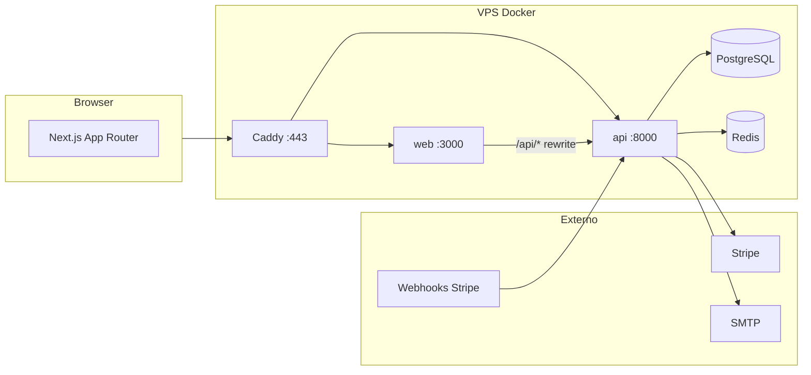
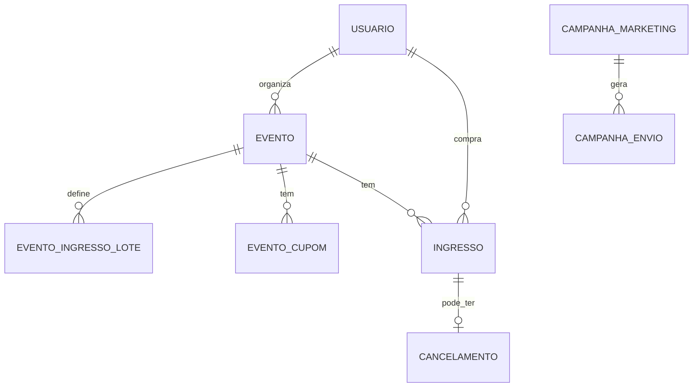
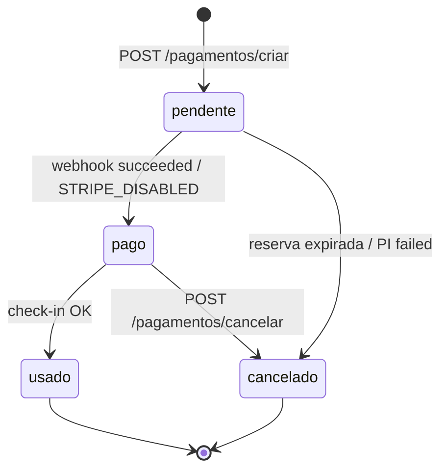
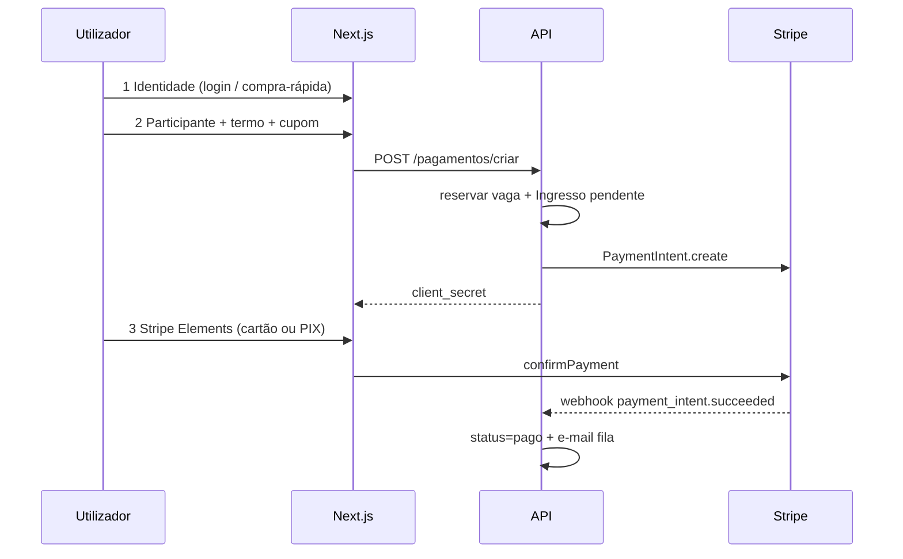

# EventosBR — Especificação do Sistema

**Versão:** 2.1  
**Última atualização:** 30/06/2026  
**Fonte de verdade:** documento único para escopo funcional, API, regras e front.  
**Alembic head:** `20260616_000019_email_verificado_portaria_token_em`  
**Pagamentos:** Stripe Connect Express (sem Asaas nesta base de código)

---

## Índice

1. [Escopo e convenções](#1-escopo-e-convenções)
2. [Visão do produto](#2-visão-do-produto)
3. [Arquitetura](#3-arquitetura)
4. [Modelos de dados](#4-modelos-de-dados)
5. [API REST](#5-api-rest)
6. [Regras de negócio](#6-regras-de-negócio)
7. [Fluxos principais](#7-fluxos-principais)
8. [Frontend](#8-frontend)
9. [Segurança e privacidade](#9-segurança-e-privacidade)
10. [Configuração, deploy e CI](#10-configuração-deploy-e-ci)
11. [Testes](#11-testes)
12. [Roadmap — fora de escopo](#12-roadmap--fora-de-escopo)
13. [Lacunas conhecidas](#13-lacunas-conhecidas)
14. [Histórico de versões](#14-histórico-de-versões)

---

## 1. Escopo e convenções

### 1.1 Cobertura

| Incluído | Excluído (ver §12) |
|----------|-------------------|
| API FastAPI, modelos, workers | Asaas BaaS / repasse Pix white-label |
| Next.js App Router | NFSe / fiscal BR |
| Stripe PI + Connect + webhooks | Cobrança de assinatura mensal (só UI) |
| Admin, portaria, marketing LGPD | Login Apple (modelo preparado) |
| Deploy Docker/Caddy/VPS | Lista de espera / interesse / urgência |

### 1.2 Convenções

| Item | Convenção |
|------|-----------|
| IDs | UUID string |
| Dinheiro na API | `valor_centavos` (int); legado `valor` em reais |
| Datas | ISO 8601; persistência UTC naive |
| Sessão browser | Cookie HttpOnly `eventosbr_session` + `Authorization: Bearer` |
| Admin | `X-Platform-Admin-Key` ou cookie `eventosbr_admin_key` (BFF Next) |
| QR check-in | `EBR1:{ingresso_uuid}:{hmac12}` |
| Categorias evento | Lista fixa em `app/utils/evento_categorias.py` (15 valores) |

### 1.3 Critérios de aceite por ator

| Ator | Critério mínimo |
|------|-----------------|
| Participante | Comprar ingresso publicado com termo aceito; ver QR; cancelar no prazo |
| Organizador | Criar evento pausado → lotes → publicar → ver relatório → comunicado |
| Portaria | Abrir link `/portaria/{id}/{token}` → scan QR → check-in com feedback |
| Admin | `/admin/setup` verde; moderar evento; exportar opt-in marketing |

---

## 2. Visão do produto

Plataforma brasileira de venda de ingressos online.

| Ator | Capacidades |
|------|-------------|
| **Participante** | Vitrine, checkout (cartão/PIX), conta, repasse de titularidade, reembolso |
| **Organizador** | CRUD eventos/lotes/cupons, publicar, relatórios, comunicados, check-in, portaria |
| **Admin** | Moderação, checklist produção, campanhas marketing |
| **Portaria** | Check-in sem conta via link secreto |

**Tarifa estimada (relatórios):** 10% + R$ 2,00 por ingresso pago (`tarifas_plataforma.py`). Não descontada automaticamente no Stripe.

---

## 3. Arquitetura



### 3.1 Workers (`app/main.py` lifespan)

| Worker | Arquivo | Intervalo | Função |
|--------|---------|-----------|--------|
| E-mail ingresso/comunicado | `ticket_email.py` | contínuo | Fila Redis ou memória; SMTP |
| Cleanup reservas | `reserva_cleanup.py` | 5 min | `pendente` expirado → `cancelado`; cancela PI |
| Lembrete pré-evento | `lembrete_evento.py` | 1 h | E-mail ~24 h antes para `pago` |

### 3.2 Health

| Rota | Uso |
|------|-----|
| `GET /health` | Liveness |
| `GET /ready` | Readiness + BD (503 se down) |

### 3.3 Migrações Alembic (histórico)

| Revisão | Tema |
|---------|------|
| `20260511_000001` | Schema inicial |
| `20260514_000006` | Lotes de ingresso |
| `20260516_000007` | Fase B (CPF limite, operação) |
| `20260517_000008` | Cupons + comunicados |
| `20260518_000009` | Opt-in marketing usuário |
| `20260519_000010` | Campanhas marketing admin |
| `20260520_000011` | OAuth Google |
| `20260522_000012`–`000013` | Portaria + repasse ingresso |
| `20260523_000014`–`000017` | token_version, reserva, senha reset |
| `20260524_000018` | Cidade + multi-ingresso |
| `20260616_000019` | email_verificado + checkin_token_em |

---

## 4. Modelos de dados

### 4.1 Diagrama ER



### 4.2 Ciclo de vida do ingresso



### 4.3 Entidades principais

**`Usuario`:** `tipo` cliente|organizador; `stripe_*`; `auth_provider` email|google|apple; `token_version`; `email_verificado`; opt-in marketing.

**`Evento`:** `slug` UK; `publicado` (default `true` na API `CriarEventoRequest` e no ORM); `cidade`; `checkin_token`+`checkin_token_em`; `limite_ingressos_por_cpf`.

**`EventoIngressoLote`:** `tipo` inteira|meia|vip|cortesia; `ordem`; janela `vendas_*`; `quantidade_maxima`.

**`EventoCupom`:** `tipo` percentual|fixo; `max_usos`/`usos`; `valido_ate`.

**`Ingresso`:** `reservado_ate` (35 min); `termo_compra_*`; `repassado_para_*`; `stripe_payment_intent_id` UK.

---

## 5. API REST

Montagem em `app/main.py`. Auth = JWT salvo indicação.

### 5.1 `/api/auth`

| Método | Rota | Auth | Descrição |
|--------|------|------|-----------|
| POST | `/registrar` | — | Registo + Stripe Customer/Connect |
| POST | `/compra-rapida` | — | Checkout guest; `email_verificado=false` |
| POST | `/login` | — | JWT + cookie |
| POST | `/logout` | — | Limpa cookie |
| POST | `/solicitar-recuperacao-senha` | — | Token por e-mail |
| POST | `/redefinir-senha` | — | Nova senha |
| POST | `/verificar-email` | — | Confirma token |
| POST | `/reenviar-verificacao-email` | JWT | Reenvio |
| GET | `/oauth-config` | — | `google_client_id` |
| POST | `/google` | — | Login/registo Google |
| POST | `/vincular-google` | JWT | Vincula conta |
| GET/PATCH | `/me` | JWT | Perfil e opt-in |

### 5.2 `/api/eventos`

| Método | Rota | Auth | Descrição |
|--------|------|------|-----------|
| POST | `/criar` | Org | `publicado` default **true**; omitir ou `false` para pausar |
| PATCH | `/id/{id}` | Dono | Atualiza; lotes com vendas não removíveis |
| GET | `/meus` | Org | Todos os eventos do organizador |
| GET | `/stats-publicas` | — | Contagens home |
| GET | `/cidades` | — | Filtro vitrine |
| GET | `` | — | Vitrine: `skip`, `limit`, `q`, `categoria`, `cidade` |
| GET | `/{slug}` | JWT opc. | Público; dono vê pausado |
| GET/POST | `/id/{id}/link-portaria`… | Dono | Link + regenerar token |
| GET/POST/DELETE | `/id/{id}/cupons`… | Dono | CRUD cupons |
| GET | `/id/{id}/resumo` | Dono | Dashboard métricas |
| POST | `/id/{id}/duplicar` | Dono | Cópia **pausada** |

**`EventoResponse` calculado:** `compra_disponivel`, `motivo_compra_indisponivel`, `preco_compra`, `lote_compra_id`, lotes com `vendidos` e `elegivel_compra`.

### 5.3 `/api/pagamentos`

| Método | Rota | Descrição |
|--------|------|-----------|
| POST | `/validar-cupom` | Preview preço com cupom |
| POST | `/criar` | Reserva + PI (ou pago imediato) |
| GET | `/meus` | Histórico (`?status=`) |
| POST | `/retomar` | Novo `client_secret` se reserva válida |
| POST | `/cancelar` | Reembolso |

**`POST /criar` — campos obrigatórios/relevantes:**

```json
{
  "evento_id": "uuid",
  "lote_id": "opcional",
  "quantidade": 1,
  "valor_centavos": 5000,
  "termo_compra_aceito": true,
  "participante_nome": "opcional",
  "participante_cpf": "obrigatório se terceiro",
  "codigo_cupom": "opcional",
  "cortesia_responsavel": "se cortesia"
}
```

**`POST /retomar`:** `{ "ingresso_id", "evento_id?" }` → falha 400 se reserva expirou ou PI fake (`disabled_`/`cortesia_`).

### 5.4 `/api/ingressos`

| Método | Rota | Descrição |
|--------|------|-----------|
| GET | `/meus` | PII mascarada |
| POST | `/{id}/repassar` | Ver payload §6.5 |
| GET | `/{id}/download` | HTML impressão |
| GET | `/{id}/codigo-checkin` | String EBR1 |
| GET | `/{id}/qr` | PNG |
| POST | `/{id}/enviar-email` | Reenvio SMTP |

### 5.5 `/api/checkin` · `/api/portaria` · `/api/organizador`

| Prefixo | Rota | Descrição |
|---------|------|-----------|
| `/api/checkin` | POST `/validar` | Organizador JWT; `{ codigo }` |
| `/api/portaria` | GET `/evento`, POST `/validar` | Sem JWT; `evento_id` + `token` + `codigo` |
| `/api/organizador` | POST `/comunicados` | E-mail massa `pago`/`usado` |

### 5.6 `/api/relatorios`

| Rota | Params | Saída |
|------|--------|-------|
| GET `/organizador` | `dias`, `evento_id` | Totais, série diária, taxas estimadas |
| GET `/organizador/participantes` | `formato=json\|csv\|pdf\|xlsx`, `mascarar_sensiveis` | Export presença |

### 5.7 `/api/admin` (header `X-Platform-Admin-Key`)

| Grupo | Rotas |
|-------|-------|
| Ops | GET `/setup` |
| Moderação | GET `/eventos`, PATCH `/{id}/publicado`, GET/PATCH `/usuarios` |
| Marketing | GET `/marketing/contatos`, CRUD `/marketing/campanhas`, POST `/{id}/disparar` |

**`CampanhaCreate`:** `nome`, `assunto`, `mensagem`, `canal` email|whatsapp|ambos, `usuario_ids[]`, `filtro_canal`, `disparar_agora`.

### 5.8 `/api/webhooks`

| Rota | Eventos / condição |
|------|-------------------|
| POST `/stripe` | `payment_intent.succeeded`, `payment_failed`, `canceled`; idempotência `stripe_events` |
| POST `/mock-payment` | Só `development` + `DEBUG` |

---

## 6. Regras de negócio

### 6.1 Lotes e vitrine

1. Lote ativo = menor `ordem` elegível (janela temporal + vaga).
2. Ocupação = `pendente` (reserva válida) + `pago` + `usado`.
3. `publicado=false` → fora da vitrine; dono acessa com JWT.
4. `preco_ingresso` = mínimo dos lotes ativos.

### 6.2 Checkout

| Regra | Valor |
|-------|-------|
| Termo obrigatório | `termo_compra_aceito=true`; versão default `2026-05-v1` |
| Quantidade | 1–10 por transação |
| Reserva | 35 min (`reservado_ate`) |
| PIX Stripe | Expira 30 min |
| Cupom | Mín. R$ 0,50 após desconto; não em cortesia |
| Cortesia | `valor_centavos=0`; `cortesia_responsavel` obrigatório |
| Connect | `transfer_data.destination` = `evento.stripe_account_id` |
| `STRIPE_DISABLED` | Marca `pago` com PI `disabled_*` |

### 6.3 Cancelamento

Ingresso `pago`, dono, dentro de `data_limite_cancelamento` → `Refund` Stripe + `Cancelamento` + `status=cancelado`.

### 6.4 Check-in e portaria

- QR HMAC obrigatório fora dev/test (`CHECKIN_REQUIRE_SIGNED`).
- Duplicado: HTTP 200 com `{ ok: false }`.
- Token portaria: rotação auto 90 dias ou 7 dias pré-evento (token > 7 dias).

### 6.5 Repasse de titularidade

```json
POST /api/ingressos/{id}/repassar
{
  "nome": "string",
  "cpf": "11 dígitos",
  "email": "email",
  "telefone": "string",
  "data_nascimento": "YYYY-MM-DD"
}
```

Só `status=pago`. `usuario_id` (comprador financeiro) não muda. Repasse pode repetir.

### 6.6 Rate limiting (produção)

| Bucket | Limite/min |
|--------|------------|
| auth_login | 30/IP |
| auth_register | 10/IP |
| checkout_criar | 25/IP |
| checkin_validar | 120/IP |
| portaria_* | 60–120/IP+evento+token |

---

## 7. Fluxos principais

### 7.1 Compra (checkout 3 passos — front)



### 7.2 Webhook pagamento

1. Verificar assinatura (`STRIPE_WEBHOOK_SECRET`) salvo dev sem secret.
2. Idempotência por `event.id` em `stripe_events`.
3. `succeeded` → `marcar_ingressos_pi_pagos` + `enqueue_ticket_email`.
4. `failed`/`canceled` → `pendente` → `cancelado` se aplicável.

### 7.3 Publicação de evento (organizador)

1. Criar com `publicado=false` (recomendado) ou pausar após criar.
2. Configurar lotes, imagem, mensagem confirmação.
3. Checklist `evento-publicar-checklist.tsx` (Connect Stripe se pago).
4. PATCH `publicado=true` enviando **lotes completos** (evita wipe acidental).

---

## 8. Frontend

### 8.1 Rotas

| Área | Rotas principais |
|------|------------------|
| Público | `/`, `/eventos`, `/eventos/[slug]`, `/planos`, `/funcionalidades`, `/documentacao` |
| Auth | `/auth`, `/auth/verificar-email` |
| Conta | `/conta`, `/conta/perfil`, `/conta/ingressos`, `/conta/pagamentos` |
| Organizador | `/organizador/*`, `/eventos/novo`, `/eventos/[slug]/editar` |
| Portaria | `/portaria/[eventoId]/[token]` |
| Admin | `/admin/dashboard` |

**Redirect:** `/evento/:slug` → `/eventos/:slug` (308).

### 8.2 Componentes críticos

| Componente | Função |
|------------|--------|
| `comprar-ingresso.tsx` | Stripe Elements + PIX |
| `checkout-stepper.tsx` | 3 passos |
| `evento-lotes-editor.tsx` | Lotes |
| `evento-cupons-editor.tsx` | Cupons |
| `checkin-portaria-client.tsx` | Scanner + beep/vibração |
| `organizador-tour.tsx` | Onboarding |
| `evento-publicar-checklist.tsx` | Gate publicação |

### 8.3 Proxy e middleware

- Browser: `/api/*` → rewrite Next → API.
- Docker SSR: `INTERNAL_API_URL=http://api:8000`.
- `middleware.ts`: sessão `/organizador`, `/conta`; admin cookie; CSP nonce.

---

## 9. Segurança e privacidade

| Controle | Implementação |
|----------|----------------|
| Senhas | bcrypt |
| JWT + invalidação | `token_version` ao desativar usuário |
| Cookie | HttpOnly, Secure (HTTPS) |
| PII listas | `mask_cpf`, `mask_telefone_br` |
| Admin | BFF sem expor `PLATFORM_ADMIN_API_KEY` no client |
| CSP | Nonce (`lib/csp.ts`) |
| PCI | Dados de cartão só no Stripe.js |
| Request tracing | `X-Request-ID` |

---

## 10. Configuração, deploy e CI

### 10.1 Variáveis `.env` (críticas)

`SECRET_KEY`, `STRIPE_*`, `GOOGLE_OAUTH_CLIENT_ID`, `EMAIL_SERVER`/`EMAIL_USER`/`EMAIL_PASSWORD`, `REDIS_URL`, `PLATFORM_ADMIN_API_KEY`, `CORS_ORIGINS`, `FRONTEND_PUBLIC_URL`, `PORTARIA_TOKEN_*`.

Checklist runtime: `GET /api/admin/setup`.

### 10.2 Deploy VPS

```bash
cd /opt/eventosbr
./scripts/deploy-vps.sh
```

O script: `git pull` → valida `.env` → sincroniza senha Postgres com o volume → `docker compose up -d --build` → aguarda API healthy.

Primeira instalação: `cp .env.production.example .env`, `./scripts/generate-secrets.sh`, `nano .env`, depois `./scripts/deploy-vps.sh`.

### 10.3 CI (`.github/workflows/ci.yml`)

| Job | Escopo |
|-----|--------|
| `api` | `pytest tests/` |
| `web` | `npm run build` |
| `e2e` | Playwright smoke (`PLAYWRIGHT_SKIP_API_CHECK=1`) |
| `e2e-compra` | Stack `docker-compose.e2e.yml` + checkout |
| `prod-compose` | Valida `docker-compose.prod.yml` |

---

## 11. Testes

| Arquivo / suite | Cobertura |
|-----------------|-----------|
| `test_api.py` | Health, auth, eventos, compra rápida |
| `test_fase_b.py` | CPF, cortesia, check-in |
| `test_fase_c.py` | Cupons, comunicados, relatórios |
| `test_fase_d.py` | Fluxo compra + e-mail |
| `test_webhook_stripe_flow.py` | PI → pago |
| `test_oauth.py` | Google |
| `test_admin_moderacao.py` | Admin |
| `test_comunicacao_marketing.py` | LGPD + campanhas |
| `e2e/smoke.spec.ts` | Páginas públicas |
| `e2e/compra-checkout.spec.ts` | Checkout E2E |

Stripe mockado em unitários; sem chamadas live na CI padrão.

---

## 12. Roadmap — fora de escopo

| Item | Estado |
|------|--------|
| Asaas BaaS | Branch/PR separado |
| NFSe | Não implementado |
| Assinatura mensal cobrada | Só simulador `/planos` |
| Login Apple | Sem rota |
| Lista espera / interesse / urgência | Não implementado |
| E2E Stripe Elements real | Pendente |
| SSO admin | Pendente |

---

## 13. Lacunas conhecidas

| # | Item | Severidade | Notas |
|---|------|------------|-------|
| 1 | `/planos` promete assinatura sem billing | Produto | Documentado em §12 |
| 2 | `docs/02`–`04` legados | Docs | Usar **este arquivo** |
| 3 | Login Apple no modelo sem API | Baixa | Roadmap |

**Corrigidos na v2.0 da spec (código):**

- `comunicados-client.tsx` → `/api/eventos/meus`
- `lembrete_evento.py` → `EMAIL_SERVER` (alinhado a `ticket_email.py`)

---

## Apêndice A — Mapa código ↔ spec

| Domínio | Rotas | Serviços | Front |
|---------|-------|----------|-------|
| Auth | `app/routes/auth.py` | `auth.py`, `oauth_*.py`, `email_verificacao.py` | `auth-client.tsx` |
| Eventos | `app/routes/eventos.py` | `ingresso_lotes.py`, `evento_portaria.py` | `evento-*-editor.tsx` |
| Pagamentos | `app/routes/pagamentos.py` | `cupom_desconto.py`, `cpf_limite.py` | `comprar-ingresso.tsx` |
| Ingressos | `app/routes/ingressos.py` | `ingresso_checkin.py`, `ingresso_qr.py` | `conta/ingressos/` |
| Portaria | `app/routes/portaria.py` | `evento_portaria.py` | `checkin-portaria-client.tsx` |
| Admin | `app/routes/admin.py` | `marketing_*.py`, `production_checks.py` | `admin/dashboard/` |
| Webhooks | `app/routes/webhooks.py` | — | — |

## Apêndice B — Erros HTTP frequentes

| Código | Contexto | Mensagem típica |
|--------|----------|-----------------|
| 400 | Checkout | Termo não aceito; valor não confere; cupom inválido; limite CPF |
| 403 | Checkout | Evento pausado (`!publicado`) |
| 404 | Recurso | Não encontrado ou sem permissão |
| 429 | Rate limit | Muitas tentativas |
| 503 | Produção | Stripe/SMTP indisponível |

---

## 14. Histórico de versões

| Versão | Data | Alteração |
|--------|------|-----------|
| 1.0 | 30/06/2026 | Consolidação inicial |
| 2.0 | 30/06/2026 | TOC, fluxos, estados, migrações, critérios aceite; correções código |
| 2.1 | 30/06/2026 | Apêndices rastreabilidade e erros HTTP |

---

*Complementos operacionais: `docs/08-deploy-hostinger.md`, `docs/09-auditoria-seguranca-ux.md`, `TROUBLESHOOTING.md`.*
