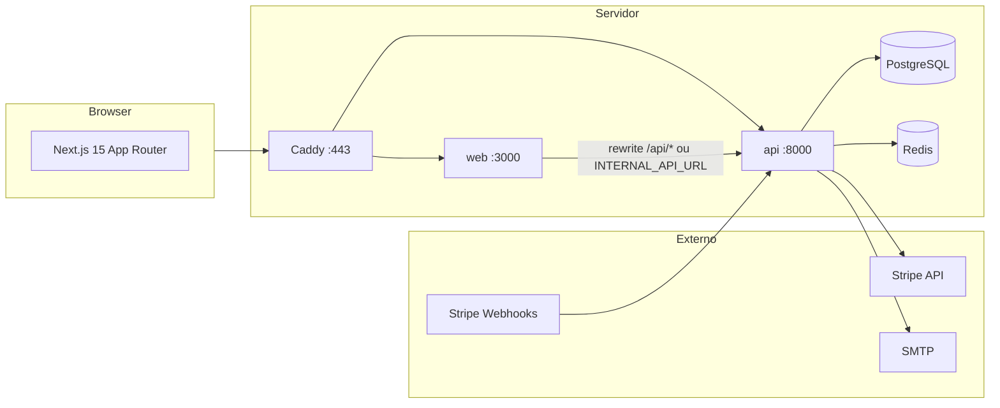
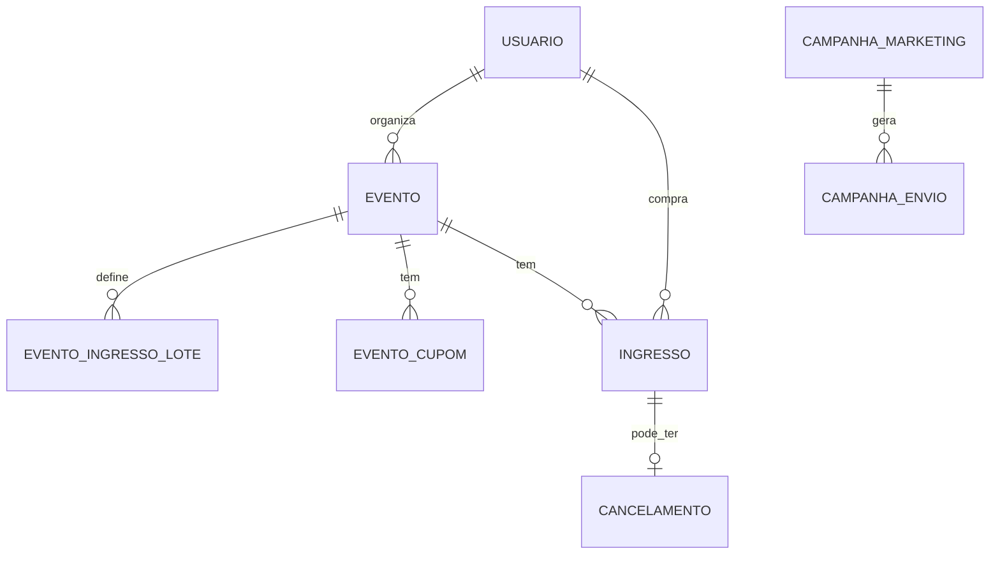

# EventosBR — Especificação do Sistema

**Versão:** 1.0  
**Última atualização:** 30/06/2026  
**Fonte de verdade:** este arquivo substitui a documentação fragmentada em `docs/02`–`05` para escopo funcional.  
**Migração Alembic (head):** `20260616_000019_email_verificado_portaria_token_em`

---

## 0. Escopo e convenções

### O que este documento cobre

- Produto, API, modelos de dados, regras de negócio, frontend, workers, segurança, configuração e deploy.
- Estado **real do código** na branch principal de desenvolvimento (Stripe Connect, sem Asaas).

### O que está fora de escopo (ver §11)

- Asaas BaaS / repasse Pix white-label (branch/PR separados).
- NFSe e conciliação fiscal brasileira.
- Cobrança de assinatura mensal (UI em `/planos` é simulação; sem API de billing).
- Login Apple (modelo preparado; sem rota).
- Lista de espera, lista de interesse, urgência de estoque (não implementados nesta base).

### Convenções

| Item | Convenção |
|------|-----------|
| IDs | UUID string |
| Valores monetários na API | `valor_centavos` (inteiro); compat. `valor` em reais (float) legado |
| Datas | ISO 8601; BD em UTC naive |
| Autenticação browser | Cookie HttpOnly `eventosbr_session` (JWT) + header `Authorization: Bearer` |
| Admin plataforma | Header `X-Platform-Admin-Key` ou cookie `eventosbr_admin_key` no Next.js |
| QR check-in | Payload `EBR1:{ingresso_uuid}:{hmac12}` |

---

## 1. Visão do produto

A **EventosBR** é uma plataforma brasileira de venda de ingressos online.

| Ator | Capacidades |
|------|-------------|
| **Participante** | Descobrir eventos, comprar (cartão/PIX via Stripe), gerenciar ingressos, repassar titularidade, cancelar com reembolso |
| **Organizador** | Criar/editar eventos e lotes, cupons, publicar na vitrine, relatórios, comunicados, check-in, link de portaria |
| **Plataforma (admin)** | Moderação, checklist de produção, campanhas de marketing LGPD |
| **Portaria (sem conta)** | Check-in via link secreto + scanner QR |

### Pagamentos

- **Provedor único:** Stripe (PaymentIntent, Refund, Connect Express para repasse ao organizador).
- **Modo dev/teste:** `STRIPE_DISABLED=true` marca ingressos como pagos sem gateway.

---

## 2. Stack e arquitetura



| Camada | Tecnologia |
|--------|------------|
| API | Python 3.11+, FastAPI, Pydantic v2, SQLAlchemy |
| BD | PostgreSQL (prod) / SQLite (dev/test) |
| Migrações | Alembic |
| Cache/filas | Redis (rate limit, fila de e-mail; fallback em memória) |
| Front | Next.js, React, TypeScript, Tailwind v4 |
| Pagamento browser | Stripe.js + Payment Element |
| Proxy prod | Caddy + `docker-compose.prod.yml` |

### Workers em background (`app/main.py` lifespan)

| Worker | Intervalo | Função |
|--------|-----------|--------|
| `ticket_email` | contínuo | Fila SMTP: ingresso individual + comunicados do organizador |
| `reserva_cleanup` | 5 min | Cancela reservas `pendente` com `reservado_ate` expirado; cancela PI Stripe |
| `lembrete_evento` | 1 h | E-mail ~24 h antes do evento para ingressos `pago` |

### Health

| Rota | Papel |
|------|-------|
| `GET /health` | Liveness (sem BD) |
| `GET /ready` | Readiness (`SELECT 1`; 503 se BD down) |

---

## 3. Modelos de dados

### Diagrama simplificado



### `Usuario`

| Campo | Descrição |
|-------|-----------|
| `email`, `nome`, `senha_hash` | `senha_hash` nullable se OAuth |
| `tipo` | `cliente` \| `organizador` |
| `auth_provider` | `email` \| `google` \| `apple` (apple sem rota) |
| `stripe_customer_id`, `stripe_account_id` | Stripe Customer + Connect Express |
| `ativo` | Admin pode desativar |
| `token_version` | Incrementado ao desativar → invalida JWTs |
| `email_verificado` | Compra rápida / verificação por token |
| `aceita_comunicacao_email`, `aceita_comunicacao_whatsapp`, `telefone` | LGPD marketing |
| `password_reset_token`, `password_reset_expires` | Recuperação de senha |

### `Evento`

| Campo | Descrição |
|-------|-----------|
| `slug` | Único; URL pública `/eventos/{slug}` |
| `publicado` | `false` por defeito na API de criação; só publicados na vitrine |
| `cidade` | Filtro na vitrine |
| `categoria` | Chips de navegação |
| `preco_ingresso` | Mínimo entre lotes ativos (sincronizado) |
| `limite_ingressos_por_cpf` | `NULL` = sem limite |
| `checkin_token`, `checkin_token_em` | Link portaria; rotação automática |
| `stripe_account_id` | Connect do organizador (cópia no evento) |
| `mensagem_confirmacao` | Texto pós-compra |

### `EventoIngressoLote`

| Campo | Descrição |
|-------|-----------|
| `tipo` | `inteira` \| `meia` \| `vip` \| `cortesia` |
| `preco` | Mín. R$ 0,50 pago; cortesia pode ser 0 |
| `ordem` | Ordem de venda |
| `quantidade_maxima` | `NULL` = ilimitado |
| `vendas_inicio`, `vendas_fim` | Janela opcional |
| `ativo` | Lote visível na resolução de compra |

### `EventoCupom`

| Campo | Descrição |
|-------|-----------|
| `codigo` | Único por evento; case-insensitive |
| `tipo` | `percentual` (0–1) \| `fixo` (reais) |
| `valor` | Percentual ou valor fixo |
| `max_usos`, `usos` | Limite opcional |
| `valido_ate` | Expiração opcional |

### `Ingresso`

| Campo | Descrição |
|-------|-----------|
| `status` | `pendente` \| `pago` \| `cancelado` \| `usado` |
| `lote_id`, `cupom_id` | Lote e cupom aplicado |
| `participante_*` | Quem usa o ingresso (pode ≠ comprador) |
| `stripe_payment_intent_id` | UK; webhook idempotente |
| `reservado_ate` | Reserva de vaga (35 min) |
| `termo_compra_aceito_em`, `termo_compra_versao` | Aceite legal |
| `data_limite_cancelamento` | Prazo reembolso |
| `checkin_em`, `checkin_por_id` | Auditoria portaria |
| `repassado_para_*`, `repassado_em` | Histórico de repasse de titularidade |
| `cortesia_responsavel` | Obrigatório em lote cortesia |

### Outros

- **`Cancelamento`:** registo de reembolso Stripe.
- **`StripeEvent`:** idempotência de webhooks.
- **`CampanhaMarketing` / `CampanhaEnvio`:** marketing da plataforma (admin).

---

## 4. API REST

Prefixos montados em `app/main.py`. Autenticação via `get_usuario_atual` salvo indicação.

### 4.1 Autenticação — `/api/auth`

| Método | Rota | Auth | Descrição |
|--------|------|------|-----------|
| POST | `/registrar` | — | Registo cliente/organizador; Stripe Customer; Connect se organizador |
| POST | `/compra-rapida` | — | Registo mínimo no checkout (nome+e-mail); envia verificação e-mail |
| POST | `/login` | — | JWT + cookie; rate limit |
| POST | `/logout` | — | Remove cookie |
| POST | `/solicitar-recuperacao-senha` | — | E-mail com token reset |
| POST | `/redefinir-senha` | — | Nova senha com token |
| POST | `/verificar-email` | — | Confirma token de verificação |
| POST | `/reenviar-verificacao-email` | JWT | Reenvia e-mail de verificação |
| GET | `/oauth-config` | — | `{ google_client_id }` para o front |
| POST | `/google` | — | Login/registo Google ID token |
| POST | `/vincular-google` | JWT | Vincula Google a conta com senha |
| GET | `/me` | JWT | Perfil (`tem_senha`, `email_verificado`, opt-in marketing) |
| PATCH | `/me` | JWT | Nome, e-mail, senha, telefone, opt-in marketing |

**Stripe no registo:** se `STRIPE_DISABLED=false` e organizador, cria Connect Express salvo `STRIPE_SKIP_CONNECT_ON_REGISTER=true`.

### 4.2 Eventos — `/api/eventos`

| Método | Rota | Auth | Descrição |
|--------|------|------|-----------|
| POST | `/criar` | Organizador | Cria evento; `publicado` default `false`; lotes opcionais |
| PATCH | `/id/{evento_id}` | Dono | Atualiza; `substituir_lotes_evento` preserva lotes com vendas |
| GET | `/meus` | Organizador | Lista eventos do organizador (incl. pausados) |
| GET | `/stats-publicas` | — | `{ eventos_publicados, ingressos_confirmados }` (home) |
| GET | `/cidades` | — | Cidades com eventos publicados |
| GET | `` | — | Vitrine: `skip`, `limit`, `q`, `categoria`, `cidade` |
| GET | `/{slug}` | Opcional JWT | Público; dono vê pausado |
| GET | `/id/{id}/link-portaria` | Dono | URL + token portaria |
| POST | `/id/{id}/link-portaria/regenerar` | Dono | Novo token manual |
| GET | `/id/{id}/cupons` | Dono | Lista cupons |
| POST | `/id/{id}/cupons` | Dono | Cria cupom |
| DELETE | `/id/{id}/cupons/{cupom_id}` | Dono | Remove cupom |
| GET | `/id/{id}/resumo` | Dono | Métricas: pagos, pendentes, check-ins, receita |
| POST | `/id/{id}/duplicar` | Dono | Cópia pausada com mesmos lotes |

**`EventoResponse` (campos calculados):** `ingresso_lotes[]` com `vendidos`, `elegivel_compra`; `lote_compra_id`, `preco_compra`, `compra_disponivel`, `motivo_compra_indisponivel`.

### 4.3 Pagamentos — `/api/pagamentos`

| Método | Rota | Auth | Descrição |
|--------|------|------|-----------|
| POST | `/validar-cupom` | JWT | Preview desconto sem criar pagamento |
| POST | `/criar` | JWT | Reserva + PaymentIntent (ou pago imediato se disabled/cortesia) |
| GET | `/meus` | JWT | Histórico; filtro `?status=` |
| POST | `/retomar` | JWT | Novo `client_secret` para ingresso `pendente` na janela |
| POST | `/cancelar` | JWT | Reembolso + `status=cancelado` |

**`POST /criar` — corpo principal:**

```json
{
  "evento_id": "uuid",
  "lote_id": "opcional",
  "quantidade": 1,
  "valor_centavos": 5000,
  "participante_nome": "opcional",
  "participante_email": "opcional",
  "participante_cpf": "opcional",
  "participante_telefone": "opcional",
  "codigo_cupom": "opcional",
  "termo_compra_aceito": true,
  "cortesia_responsavel": "se cortesia"
}
```

**Resposta:** `client_secret`, `ingresso_id`, `ingresso_ids[]`, `quantidade`, `pix_disponivel?`, `payments_disabled?`, `cortesia?`.

### 4.4 Ingressos — `/api/ingressos`

| Método | Rota | Auth | Descrição |
|--------|------|------|-----------|
| GET | `/meus` | JWT | Lista com PII mascarada; `reservado_ate` se pendente |
| POST | `/{id}/repassar` | JWT | Transfere participante; histórico em `repassado_para_*` |
| GET | `/{id}/download` | JWT | HTML imprimível |
| GET | `/{id}/codigo-checkin` | JWT | String `EBR1:…` |
| GET | `/{id}/qr` | JWT | PNG QR (só `pago`/`usado`) |
| POST | `/{id}/enviar-email` | JWT | Reenvia ingresso por SMTP |

### 4.5 Check-in — `/api/checkin`

| Método | Rota | Auth | Descrição |
|--------|------|------|-----------|
| POST | `/validar` | Organizador JWT | `{ codigo }` → marca `usado` |

### 4.6 Portaria — `/api/portaria`

Sem JWT. Token no query/body.

| Método | Rota | Descrição |
|--------|------|-----------|
| GET | `/evento?evento_id=&k=` | Metadados do evento |
| POST | `/validar` | `{ evento_id, token, codigo }` → check-in |

### 4.7 Organizador — `/api/organizador`

| Método | Rota | Descrição |
|--------|------|-----------|
| POST | `/comunicados` | `{ evento_id, assunto, mensagem }` → e-mail em massa para `pago`/`usado` |

### 4.8 Relatórios — `/api/relatorios`

| Método | Rota | Descrição |
|--------|------|-----------|
| GET | `/organizador` | Totais, por evento, série diária; `dias`, `evento_id` |
| GET | `/organizador/participantes` | `formato=json\|csv\|pdf\|xlsx`; `mascarar_sensiveis` |

### 4.9 Admin — `/api/admin`

Requer `X-Platform-Admin-Key`.

| Método | Rota | Descrição |
|--------|------|-----------|
| GET | `/setup` | Checklist produção (sem segredos) |
| GET | `/eventos` | Todos os eventos; filtro `publicado` |
| PATCH | `/eventos/{id}/publicado` | Moderação vitrine |
| GET | `/usuarios` | Lista usuários |
| PATCH | `/usuarios/{id}/ativo` | Ativa/desativa + `token_version++` |
| GET | `/marketing/contatos` | Opt-in LGPD; export JSON/CSV |
| GET/POST | `/marketing/campanhas` | CRUD campanhas |
| GET | `/marketing/campanhas/{id}` | Detalhe + log envios |
| POST | `/marketing/campanhas/{id}/disparar` | Dispara fila |

### 4.10 Webhooks — `/api/webhooks`

| Método | Rota | Descrição |
|--------|------|-----------|
| POST | `/stripe` | `payment_intent.succeeded/failed/canceled`; idempotência `stripe_events` |
| POST | `/mock-payment` | Só `development`+`DEBUG`: marca pago sem Stripe |

---

## 5. Regras de negócio

### 5.1 Lotes e vitrine

1. Lote à venda = menor `ordem` entre ativos, dentro da janela temporal, com vaga.
2. Ocupação = ingressos `pendente` (reserva válida) + `pago` + `usado`.
3. Remoção de lote bloqueada se houver vendas/reservas.
4. Evento pausado (`publicado=false`): oculto na vitrine; dono acessa por slug com JWT.

### 5.2 Checkout e pagamento

1. **`termo_compra_aceito`** obrigatório (`versão` default `2026-05-v1`).
2. **`valor_centavos`** deve coincidir com preço do lote × quantidade (− cupom).
3. **Quantidade:** 1–10 ingressos por transação.
4. **CPF:** validado se informado; limite por evento via `limite_ingressos_por_cpf`.
5. **Cortesia:** `valor_centavos=0`; sem Stripe; exige `cortesia_responsavel`.
6. **Reserva:** `reservado_ate` = agora + 35 min; PIX expira em 30 min no Stripe.
7. **Connect:** `transfer_data.destination` = `evento.stripe_account_id` quando presente.
8. **Cupom:** mínimo R$ 0,50 após desconto; não aplica a cortesia.

### 5.3 Cancelamento

- Só `pago`, dentro de `data_limite_cancelamento`, dono do ingresso.
- `stripe.Refund.create` com idempotency key; registo em `Cancelamento`.

### 5.4 Check-in

- QR assinado `EBR1:{uuid}:{hmac}`; obrigatório fora `development`/`test`.
- Duplicado retorna `{ ok: false, motivo: "já utilizado" }` sem erro HTTP.
- Portaria: rate limit por IP + evento + token.

### 5.5 Token portaria

- Geração lazy no primeiro acesso ao link.
- Rotação automática: token > 90 dias OU evento em ≤ 7 dias e token > 7 dias.
- Regeneração manual invalida link anterior.

### 5.6 Tarifas (estimativa)

| Plano | Taxa por ingresso pago |
|-------|------------------------|
| Padrão | 10% + R$ 2,00 |
| Assinatura (UI only) | Simulado em `/planos`; **sem cobrança real** |

Cálculo: `app/services/tarifas_plataforma.py` — usado em relatórios estimados, não descontado automaticamente no Stripe.

### 5.7 Rate limiting (produção/staging)

| Bucket | Limite |
|--------|--------|
| `auth_login` | 30/min IP |
| `auth_register` | 10/min IP |
| `checkout_criar` | 25/min IP |
| `checkin_validar` | 120/min IP |
| `portaria_*` | 60–120/min IP+evento+token |

Redis se disponível; senão memória do processo.

---

## 6. Frontend (Next.js)

### 6.1 Rotas públicas

| Rota | Função |
|------|--------|
| `/` | Landing + eventos em destaque + stats |
| `/eventos` | Vitrine com busca, categoria, cidade |
| `/eventos/[slug]` | Detalhe + checkout 3 passos |
| `/planos` | Preços + simulador de lucro (sem billing) |
| `/funcionalidades` | Marketing de features |
| `/sobre`, `/termos`, `/privacidade` | Institucional |
| `/documentacao` | Resumo técnico no site |
| `/auth` | Login, registo, OAuth Google, recuperação senha |
| `/auth/verificar-email` | Confirmação de e-mail |

**Alias:** `/evento/:slug` → redirect 308 para `/eventos/:slug`.

### 6.2 Conta (`/conta/*`)

| Rota | Função |
|------|--------|
| `/conta` | Hub |
| `/conta/perfil` | Dados, senha, opt-in marketing |
| `/conta/ingressos` | Lista; badge "Repassado" |
| `/conta/ingressos/[id]` | QR, download, e-mail, repasse, cancelar |
| `/conta/pagamentos` | Histórico + retomar pagamento pendente |

### 6.3 Organizador (`/organizador/*`)

Middleware exige `tipo=organizador`.

| Rota | Função |
|------|--------|
| `/organizador/eventos` | Lista + publicar/pausar |
| `/organizador/novo`, `/eventos/novo` | Criação |
| `/eventos/[slug]/editar` | Editor completo (lotes, cupons, imagem) |
| `/organizador/relatorios` | Gráficos + export participantes |
| `/organizador/financeiro` | Resumo receita (API relatórios) |
| `/organizador/comunicados` | E-mail em massa |
| `/organizador/checkin` | Scanner QR (organizador) |
| `/organizador/perfil` | Perfil organizador |

**Componentes chave:** `comprar-ingresso.tsx` (Stripe Elements + PIX), `evento-lotes-editor.tsx`, `evento-cupons-editor.tsx`, `evento-publicar-checklist.tsx`, `organizador-tour.tsx`, `checkin-portaria-client.tsx`.

### 6.4 Portaria

| Rota | Função |
|------|--------|
| `/portaria/[eventoId]/[token]` | Check-in sem login; beep/vibração no sucesso |

`NEXT_PUBLIC_LAN_ORIGIN` — origem alternativa para tablets na rede local.

### 6.5 Admin

| Rota | Função |
|------|--------|
| `/admin` | Entrada |
| `/admin/dashboard` | Abas: Produção, Eventos, Usuários, Contatos, Campanhas |

Proxy BFF: `/api/admin/proxy/*` → API com cookie admin (sem expor `PLATFORM_ADMIN_API_KEY` no browser).

### 6.6 Proxy e sessão

- Browser: `fetch("/api/...")` via rewrite Next → API.
- SSR Docker: `INTERNAL_API_URL=http://api:8000`.
- Middleware: valida `/api/auth/me`; CSP com nonce em produção; bloqueia admin sem cookie.

---

## 7. Segurança e privacidade

| Controle | Implementação |
|----------|----------------|
| Senhas | bcrypt |
| JWT | `SECRET_KEY` ≥ 32 chars em produção; `token_version` |
| Cookie sessão | HttpOnly, Secure em HTTPS |
| PII em listas | `mask_cpf`, `mask_telefone_br` |
| Check-in | HMAC no QR (`CHECKIN_REQUIRE_SIGNED`) |
| Admin | Chave separada; proxy sem leak de env no Next |
| CSP | Nonce por request (`lib/csp.ts`) |
| CORS | Lista explícita em produção (nunca `*`) |
| Request ID | Header `X-Request-ID` |
| PCI | Cartão só no Stripe.js |

---

## 8. Configuração

### Variáveis críticas (`.env`)

Ver `.env.production.example` e `GET /api/admin/setup`.

| Variável | Uso |
|----------|-----|
| `SECRET_KEY` | JWT + assinatura QR |
| `STRIPE_*` | Pagamentos |
| `STRIPE_DISABLED` | Só dev/teste |
| `GOOGLE_OAUTH_CLIENT_ID` | Login Google |
| `EMAIL_*` | SMTP transacional |
| `REDIS_URL` | Rate limit + fila e-mail |
| `PLATFORM_ADMIN_API_KEY` | Admin API |
| `CORS_ORIGINS`, `FRONTEND_PUBLIC_URL` | URLs públicas |
| `PORTARIA_TOKEN_MAX_AGE_DAYS` (90) | Rotação token |
| `PORTARIA_TOKEN_ROTATE_BEFORE_EVENT_DAYS` (7) | Rotação pré-evento |

### Deploy VPS

```bash
cd /opt/eventosbr
cp .env.production.example .env
./scripts/generate-secrets.sh
nano .env
./scripts/deploy-vps.sh   # git pull + update-env-vps + docker compose prod
```

---

## 9. Testes

| Suite | Escopo |
|-------|--------|
| `pytest tests/` | API: auth, eventos, pagamentos, cupons, check-in, OAuth, admin, webhooks |
| Playwright `e2e/smoke` | Páginas públicas |
| Playwright `e2e/compra` | Checkout com API (`docker-compose.e2e.yml`) |
| CI | `api`, `web`, `e2e`, `e2e-compra`, `prod-compose` |

Stripe mockado nos testes unitários; E2E compra usa `STRIPE_DISABLED` ou stack dedicada.

---

## 10. Roadmap — não implementado

| Item | Notas |
|------|-------|
| Asaas BaaS / repasse Pix | Branch `cursor/baas-transfer-auth-bf71` (fora desta spec) |
| NFSe / comprovante fiscal | Fase D |
| Assinatura mensal cobrada | Só UI `/planos` |
| Login Apple | Campo `auth_provider` existe |
| Lista de espera / interesse | — |
| Urgência de estoque (badges) | — |
| SSO admin / operadores | — |
| WhatsApp nativo | Webhook opcional em campanhas admin |
| E2E Stripe Elements real | `E2E_STRIPE=1` pendente |
| Monitoramento estruturado | Alertas `/ready` 503 |

---

## 11. Lacunas conhecidas (código vs spec desejada)

| # | Item | Severidade |
|---|------|------------|
| 1 | `comunicados-client.tsx` chama `/api/eventos/organizador/meus` — rota correta é `/api/eventos/meus` | **Bug** |
| 2 | Página `/planos` promete assinatura mensal sem backend de cobrança | Produto/marketing |
| 3 | `docs/02`–`04` desatualizados — **usar este arquivo** | Documentação |
| 4 | `lembrete_evento.py` referencia `EMAIL_HOST`/`EMAIL_USE_TLS`; settings usa `EMAIL_SERVER` | Possível bug SMTP lembrete |

---

## 12. Histórico de versões

| Versão | Data | Alteração |
|--------|------|-----------|
| 1.0 | 30/06/2026 | Consolidação inicial: API completa, regras, front, workers, segurança, deploy |

---

*Documentos complementares (não substituem esta spec): `docs/08-deploy-hostinger.md` (ops VPS), `docs/09-auditoria-seguranca-ux.md` (checklist auditoria), `TROUBLESHOOTING.md`.*
